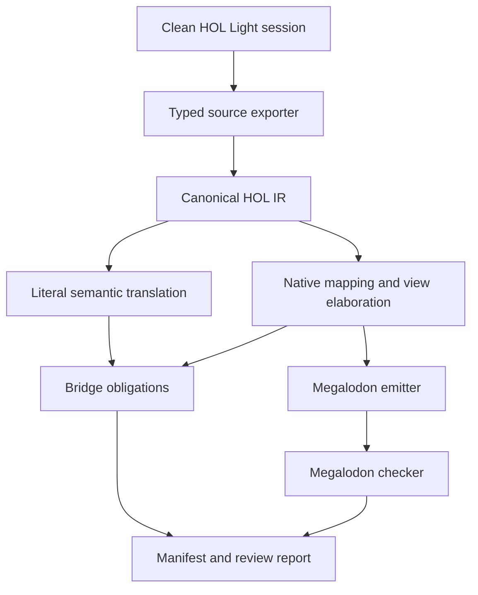

# HOL Light to Megalodon Translator

## High-level design and implementation proposal

**Status:** worker-facing design proposal

**Primary goal:** repeatedly translate the statements of a growing HOL Light corpus into a readable, native Megalodon mathematical library

**Later goal:** translate or reconstruct HOL Light proofs in checked Megalodon proof style

**Reference HOL Light revision inspected:** `433477862bb90b328a593e012e09390e99b2439b` (2026-08-17)

## 1. Executive decision

Build a two-layer translator, but publish only one layer:

1. A **private semantic layer** gives every HOL type and term a uniform, exact set-theoretic meaning. It is a GRUNGE-style correctness oracle and later a proof-transport layer. It may contain generated concepts such as source carriers, encoded application, and source symbol identifiers. It lives under an internal namespace and is not normal Megalodon API.
2. A **public native layer** states the mathematics as a Megalodon author following the Godement instructions would state it: native sets, bounded quantifiers, native numbers, meta-level functions where possible, and bounded set-functions only where functions genuinely have to be set values.

The translator must not print an `hlist`, `HOLType`, graph-function, or generic encoded-application vocabulary into the public library. It must also never silently guess a native identification. Every identification—HOL Light `num` with `omega`, HOL lists with finite sequences, HOL reals with `R`, and so on—must be an explicit, versioned mapping with a recorded correctness obligation.

During the statement-first stages, translated source theorems are emitted as `Theorem ... Admitted.`, never as new `Axiom`s. Definitions are emitted only when they are approved native definitions and typecheck. An admitted theorem is visibly unfinished and can later be replaced by a checked proof or archived only after Megalodon has checked that proof.

This is not one pass from HOL syntax to Megalodon text. It is a compiler with typed intermediate representations, a reviewed semantic mapping database, native view elaboration, deterministic emission, and aggressive validation.

## 2. Scope and non-goals

### 2.1 Statement-stage scope

The first production system must:

- load a pinned HOL Light revision and selected library profile in a clean process;
- extract typed theorem statements without parsing HOL pretty-printed text;
- retain source names, hypotheses, polymorphic instances, and provenance;
- translate logical structure deeply into Megalodon propositions;
- map reviewed mathematical types and constants to existing or newly approved native Megalodon concepts;
- generate readable `.mg` modules plus machine-readable manifests and review reports;
- incrementally regenerate only affected outputs;
- run the Megalodon checker on all generated statement modules;
- make uncertainty or missing mappings explicit rather than emitting plausible-looking mathematics.

### 2.2 Deferred scope

The first system does **not** need to:

- translate HOL tactics;
- make admitted theorems trusted;
- reproduce the layout of HOL Light proof scripts;
- automatically invent a native representation for every user-defined type;
- preserve source theorem names as the public API when a better native name exists;
- expose the uniform semantic encoding to ordinary Megalodon users.

Proof recording and proof compilation are a later workstream described in Section 15.

## 3. What “the statement is right” means

A statement is not right merely because both sides parse or look analogous. For each source theorem, the pipeline must maintain three artifacts:

1. **Source statement:** an alpha-canonical typed HOL sequent, extracted from the kernel value.
2. **Literal semantic statement:** a compositional set-theoretic interpretation of that sequent.
3. **Public native statement:** the mathematical theorem a Megalodon user should see.

The public statement has one of these statuses:

| Status | Meaning | Publication policy |
|---|---|---|
| `exact_native` | The native statement is a definitional or directly certified rendering of the literal semantics. | Publish. |
| `transport_required` | It uses an explicit isomorphism or representation change, such as HOL reals to `R` or lists to finite sequences. A bridge obligation is recorded. | Publish only after mapping review; theorem remains admitted until proof transport exists. |
| `generalization_required` | It deliberately removes a source inhabitedness premise or otherwise states a more native generalization. The extra case or strengthening obligation is recorded. | Publish only after review; preferably prove the small generalization early. |
| `pending_mapping` | Some source concept has no approved native meaning. | Do not put it in the default public module. Include it in reports or an opt-in quarantine module. |
| `raw_only` | Only the private literal statement is available. | Internal output only. |

The manifest must record a bridge plan for every `transport_required` or `generalization_required` item. Later, a theorem is fully trusted only when both the literal HOL proof and all required transport/generalization steps have checked Megalodon proofs.

This distinction is essential for such identifications as:

- HOL Light `num` ↔ Megalodon `omega`;
- HOL Light `int` ↔ Megalodon `int`;
- HOL Light `real` ↔ Megalodon `R`;
- HOL Light `A list` ↔ native finite sequences over `A`;
- HOL predicates `A -> bool` ↔ subsets of `A`;
- HOL function values `A -> B` ↔ members of `B :^: A` when they must be sets.

## 4. Target-language policy: follow the Godement rules

The emitter and mapping reviewers must enforce these rules.

### 4.1 Use meta-level functions by default

A unary mathematical operation should normally have Megalodon type `set -> set`; a binary operation should normally have `set -> set -> set`. A predicate should normally use `set -> prop` when it is used as a predicate rather than as mathematical data.

Examples:

```text
f : set -> set
op : set -> set -> set
P : set -> prop
```

Give such functions bounded closure conditions where necessary:

```text
forall x :e A, f x :e B
```

### 4.2 Reify a function only at a set-value boundary

When a function has to inhabit a function space, a list, a tuple, a set, or another HOL value, reify it with the native bounded lambda:

```text
(fun x :e A => f x) :e B :^: A
```

Apply a reified function with native `ap`/implicit application. Use the standard `lam_Pi`, `beta`, `beta0`, `Pi_ext`, `Pi_eta`, and `ap_Pi` infrastructure; do not introduce ordered-pair graph APIs into generated public code.

### 4.3 Use native sets and bounded quantifiers

Translate membership and domain restrictions to idiomatic forms such as:

```text
forall x :e A, ...
exists x :e A, ...
X c= A
```

Use `omega`, `int`, `rational`, and `R` for reviewed identifications with HOL Light number systems. Reuse target definitions instead of duplicating them.

### 4.4 Use `Admitted`, not invented axioms

Statement-only output has the form:

```text
Theorem seq_map_id : ... .
Admitted.
```

The exact terminating syntax must be verified against the selected Megalodon revision, but the semantic policy is fixed: an unproved import is an admitted theorem, not a newly asserted axiom.

## 5. The crucial function-value discipline

This is the most important elaboration rule.

It is attractive to translate every HOL function `f : A -> B` to a Megalodon variable `f : set -> set`. That is correct only while `f` is used applicatively on arguments from `A`. It is not generally correct to translate HOL function equality to Megalodon meta-function equality: two meta-functions may agree on every member of `A` and differ elsewhere, whereas they denote the same HOL function.

The translator therefore tracks a **view** of every function expression.

| View | Megalodon form | Use |
|---|---|---|
| `MetaFun(A,B)` | `f : set -> set` plus `forall x :e A, f x :e B` | Direct application and ordinary operator arguments. |
| `SetFun(A,B)` | `F :e B :^: A` | Stored, compared as a value, nested inside a datatype, or passed to a higher-order operation whose domain is a function carrier. |

Conversions are native:

```text
quote[A,B](f) = fun x :e A => f x
run(F)        = fun x:set => F x
```

The concrete output normally inlines these conversions. `quote` and `run` are names in the compiler IR, not required public Megalodon constants.

The elaboration rules are:

- HOL application `f x` stays `f x` when `f` has `MetaFun` view.
- If `F` has `SetFun` view, application is native set-function application `F x`.
- A meta-function entering data is emitted as `fun x :e A => f x`.
- A set-function used applicatively is viewed as `fun x:set => F x`.
- HOL equality at function type is emitted either as equality of reified functions or, preferably, the readable equivalent `forall x :e A, f x = g x`.
- A function nested under another HOL type constructor is always a set value. For example, `(A -> B) list` maps to finite sequences over `B :^: A`, not finite sequences over a Megalodon meta-type.

Example: for `H : (A -> B) -> C` and `f : A -> B`, make `H` a meta-function on the native carrier `B :^: A`, then translate `H f` as:

```text
H (fun x :e A => f x)
```

with closure premise:

```text
forall F :e B :^: A, H F :e C
```

This avoids both graph-style public functions and unsound dependence on a meta-function outside its HOL domain.

### 5.1 Required elaboration algorithm

Do not implement this discipline as ad hoc pretty-printer cases. Give the native elaborator an explicit judgment:

```text
elaborate(environment, source_term, expected_role)
  -> native_term * generated_conditions * bridge_steps
```

The relevant `expected_role`s are:

- `Prop`: a proposition;
- `SetValue(C)`: a set member of carrier `C`;
- `MetaFun(A,B)`: an applicative meta-function from `A` to `B`;
- `Predicate(A)`: a meta-predicate on `A`;
- `Subset(A)`: a set contained in `A`;
- `Carrier`: a set used as a type carrier.

The environment records a source variable's HOL type, its current native view, its carrier parameters, and all already generated closure/subset conditions.

Use these deterministic rules:

1. **Variables and mapped constants:** consult their typed registry role. If it differs from `expected_role`, insert only a registered view conversion.
2. **Application:** first inspect the source operator's complete type and mapping entry. Elaborate each argument in the role declared by that entry. For an unmapped source function, use its HOL domain carrier to decide between meta application and native set application.
3. **Lambda:** in `MetaFun(A,B)` role emit a meta-lambda and generate bounded result closure; in `SetValue(B :^: A)` role emit `fun x :e A => ...` directly.
4. **Equality:** at a carrier whose values are functions, compare reifications or emit bounded pointwise equality. At predicate/subset type, compare subsets extensionally. At ordinary set-valued types, use set equality.
5. **Data construction:** tuple, finite-sequence, set, and other carrier constructors request `SetValue` children. This automatically reifies nested functions and predicates.
6. **Higher-order application:** the domain carrier of an outer source function determines the inner value representation. If the input HOL type is `A -> B`, the outer function accepts a member of `B :^: A`; quote an applicative inner function at that boundary.
7. **Formula escape:** deep translation may use `prop` only while the boolean remains in formula context. If it becomes data, inject it into the approved first-class Boolean carrier.
8. **No implicit coercion:** if more than one view conversion could apply, or a required bridge is unregistered, stop with a diagnostic containing the source subterm and expected role.

Run a post-pass that checks every inserted quote has the right bounded domain and every meta-function free variable has sufficient closure premises. This check must operate on typed native IR, not emitted text.

## 6. Native carrier design

Every HOL value type still has a set-valued carrier when the type is used as data. The public carrier registry begins as follows.

| HOL Light type | Native Megalodon carrier/view | Notes |
|---|---|---|
| type variable `'a` | set parameter `A` | Add `A <> Empty` by default; remove only by certified empty-case generalization. |
| `bool` in formula position | `prop` | Translate connectives and quantifiers deeply. |
| first-class `bool` | canonical two-element set | Use only when booleans are data. |
| `'a -> 'b` as a value | `B :^: A` | Use meta-function view when applicative; reify at value boundaries. |
| `'a -> bool` as a predicate/set | `Power A`, normally a subset `X c= A` | Application becomes membership. Particularly natural for HOL Light sets. |
| `'a # 'b` | `A :*: B` | Use native tuple/set-product infrastructure. |
| `'a list` | `finseq A` | Define as finite sequences, not a generated HOL datatype wrapper. |
| `num` | `omega` | Requires reviewed operation and induction bridges. |
| `int` | `int` | Requires a source-to-target isomorphism/operation bridge. |
| `real` | `R` | Requires a substantial bridge; do not infer it from the shared name. |
| `complex` | approved native complex carrier | Reuse target library if present; otherwise define natively over `R`. |
| `real^N` / Cartesian types | appropriate native finite product/function carrier | The finite-index type and dimension conventions need explicit mappings. |

### 6.1 Lists as finite sequences

A native starting point is:

```text
Definition finseq : set -> set :=
fun A => Sigma_ n :e omega, A :^: n.

Definition seq_map : (set -> set) -> set -> set :=
fun f l => (l 0, fun i :e l 0 => f (l 1 i)).
```

The final definitions must be adapted to existing target names and proved well-typed. The corresponding public image of HOL Light `MAP_ID` should look like ordinary Megalodon mathematics:

```text
// HOL Light: lists.ml / MAP_ID
Theorem seq_map_id :
  forall A:set, forall l :e finseq A,
    seq_map (fun x:set => x) l = l.
Admitted.
```

The source’s nonempty type-variable convention does not need to remain in this particular public theorem: if `A` is empty, the only finite sequence over `A` is empty, so the statement still holds. That omission must be tagged `generalization_required` until the empty case is mechanically certified.

For a list of functions, no new meta-type is needed:

```text
finseq (B :^: A)
```

An applicative function is inserted into such a list as `fun x :e A => f x` and recovered applicatively with native set-function application.

### 6.2 Type definitions

Do not mechanically reproduce every HOL Light `new_type_definition` as an abstract target wrapper. Classify it:

- **existing native concept:** map it to the existing target carrier;
- **structural datatype:** map it to a native sum, product, finite sequence, tree, or other set construction;
- **subtype:** map it to separation `{x :e A | P x}` when that is the intended mathematics;
- **quotient:** use or build a native quotient construction and record the equivalence relation;
- **opaque or not yet understood:** keep it internal or `pending_mapping`; do not invent a public representation.

The abstraction and representation constants from HOL Light become bridge material, not automatically part of the public API.

## 7. Compiler architecture



Implement the components as separate packages with a stable serialized boundary after extraction. Recommended implementation languages:

- **HOL exporter:** OCaml, loaded inside HOL Light.
- **Translator and emitter:** typed OCaml with `dune`; it can share schema types with the exporter but must run as a standalone deterministic program.
- **Configuration:** checked YAML or JSON decoded into typed OCaml values. Never interpret mapping templates as unchecked string substitution.
- **Target validation:** invoke the selected Megalodon binary as an external checker. Do not duplicate its parser/typechecker unless a stable library interface becomes available.

Suggested repository layout:

```text
hol2mg/
  dune-project
  hol_export/
    export.ml
    export_profile.ml
    json_writer.ml
  lib/
    source_ir.ml
    semantic_ir.ml
    native_ir.ml
    canonicalize.ml
    native_elab.ml
    dependency.ml
    manifest.ml
  mappings/
    core.yaml
    sets.yaml
    data.yaml
    numbers.yaml
    analysis.yaml
    overrides/
  emit/
    megalodon_emit.ml
    names.ml
  profiles/
    core.yaml
    standard.yaml
    multivariate.yaml
    full.yaml
  tests/
    fixtures/
    golden/
    integration/
  generated/
    internal/
    public/
    manifests/
    reports/
  docs/
```

Generated files should normally be committed separately from the translator or published from CI, depending on the target library workflow. In either case, source revision and mapping revision are pinned in every generation manifest.

## 8. HOL Light extraction design

### 8.1 Never parse printed terms

Use the kernel-level constructors and destructors exposed by `fusion.ml`:

- types: `Tyvar`, `Tyapp`, `types`, `get_type_arity`;
- terms: `Var`, `Const`, `Comb`, `Abs`, `type_of` and destructors;
- theorems: `dest_thm`, `hyp`, `concl`;
- declarations: `constants`, `definitions`, `axioms`.

Pretty printing loses binding identity, instantiated constant types, and stable syntax information. It is for diagnostics only.

### 8.2 Theorem-name discovery is not a kernel feature

A HOL Light theorem value does not carry its OCaml binding name. The current repository’s `update_database/update_database_5.ml` finds top-level values whose OCaml type is `thm` by inspecting the OCaml toplevel environment and evaluating them. This is the right initial mechanism, with two caveats:

1. it uses OCaml internals and `Obj.magic`, so the version-specific update-database file must match the OCaml compiler;
2. the environment contains aliases and potentially unrelated theorem values.

Use a hybrid policy:

- for stock and automatically loaded libraries, call the matching `Lookuptheorems.all_theorems()` after the profile has loaded;
- deduplicate aliases by canonical sequent hash while preserving every source alias in metadata;
- allow profiles to give explicit `(name, thm)` registrations for user projects or ambiguous cases;
- retain `database.ml` as a stable fallback for the standard library, but do not rely on it for newly loaded formalizations;
- fail the build if an explicitly requested theorem cannot be found.

Do not pretend that a static regex over `let NAME = prove ...` is authoritative. A source indexer may provide advisory file/line provenance, but kernel values determine statements.

### 8.3 Clean build profiles

Each export profile specifies:

- exact HOL Light Git commit;
- OCaml version and startup command;
- root files to `needs`;
- optional theorem includes/excludes;
- expected source file digests;
- explicit theorem registrations if needed;
- resource limits.

Run every profile in a clean process. HOL Light’s loader tracks loaded files by basename and digest; an ambient interactive session is unsuitable for reproducible export.

Recommended initial profiles are `core`, `standard`, `multivariate`, and `full`. Additional projects get their own roots without changing the compiler.

### 8.4 Source IR

Serialize records as versioned JSON Lines initially. Each record has a `schema_version`, `kind`, stable identity, and provenance. Use de Bruijn indices for bound variables in the canonical form, while retaining original binder names for diagnostics.

Core type:

```text
hol_type :=
  | TyVar(stable_id, display_name)
  | TyApp(source_name, hol_type list)

term :=
  | Bound(index, hol_type)
  | Free(stable_id, display_name, hol_type)
  | Const(source_name, occurrence_type, inferred_type_arguments)
  | App(term, term, result_type)
  | Lam(display_name, domain_type, body, function_type)

sequent := {
  hypotheses : term list;
  conclusion : term;
}
```

For every constant occurrence, preserve its fully instantiated occurrence type. Recover explicit type arguments by matching the registered principal constant type against the occurrence type; reject non-unique or inconsistent matches.

Theorem metadata includes:

- all discovered source aliases;
- preferred source name;
- canonical sequent hash;
- source revision and export profile;
- best available source file/line;
- constants and type constructors referenced;
- whether it is an axiom, definition theorem, named theorem, or generated declaration;
- extraction warnings.

### 8.5 Definitions and provenance

At minimum, export snapshots of `types()`, `constants()`, `definitions()`, `axioms()`, and all named theorems. For better provenance, add a small translation-build patch around the HOL loader that records file entry/exit and declaration deltas. Keep this patch minimal and tested against every pinned upstream revision.

Do not make exact statement extraction depend on perfect file provenance. If loader instrumentation breaks after an upstream update, extraction should still work and mark provenance incomplete.

## 9. Intermediate representations and passes

Use three typed IRs.

### 9.1 Canonical HOL IR

Contains only source constructs and types. Passes:

1. validate types of every node;
2. alpha-canonicalize binders;
3. normalize theorem hypothesis order deterministically without changing multiplicity semantics;
4. identify deep logical structure (`forall`, `exists`, implication, conjunction, equality, choice, conditionals);
5. compute stable hashes and dependency sets.

### 9.2 Literal semantic IR

Superseded by §21.2 (post-audit contract).  Original sketch — implements the uniform
set-theoretic translation:

- each HOL type is a nonempty set carrier;
- arrow types are native function sets;
- applications use set application;
- lambdas use bounded set lambdas;
- formulas are translated deeply to `prop` whenever possible;
- first-class booleans use a fixed set encoding only when required.

This layer should be boring, compositional, and exact. Optimize for auditability, not beauty. It provides a fallback and later proof target, but is never the normal imported library.

### 9.3 Native Megalodon IR

This IR distinguishes:

- `SetTerm` and `PropTerm`;
- arbitrary Megalodon meta-types needed by meta-functions;
- bounded quantifiers;
- `MetaFun` and `SetFun` views;
- target carrier expressions;
- native definitions, theorem declarations, imports, comments, and proof placeholders;
- generated side conditions and bridge obligations.

Passes:

1. resolve type-carrier mappings;
2. resolve overloaded source constants by full type scheme, not just name;
3. translate formula structure;
4. infer use contexts and function/predicate views;
5. insert reification or dereification at boundaries;
6. synthesize closure, subset, and inhabitedness premises;
7. simplify through approved native rewrite rules;
8. rename to public target names;
9. build bridge/generalization obligations;
10. pretty-print only after the typed IR validates.

## 10. Mapping registry

The mapping registry is the semantic heart of the project and should receive code-review discipline comparable to source code.

A type mapping entry includes:

```yaml
source_type: "list('a)"
target_carrier: "finseq(${A})"
kind: "native_isomorphism"
target_module: "data/finseq.mg"
bridge: "hol_list_finseq_iso"
nonempty_rule: "finseq_nonempty"
status: "reviewed"
```

A constant mapping entry includes at least:

```yaml
source_name: "MAP"
source_scheme: "('a -> 'b) -> 'a list -> 'b list"
target_name: "seq_map"
arguments:
  - role: "meta_function"
    domain: "A"
    codomain: "B"
  - role: "set_value"
    carrier: "finseq(A)"
result:
  role: "set_value"
  carrier: "finseq(B)"
side_conditions:
  - "forall x :e A, f x :e B"
bridge: "hol_MAP_seq_map"
status: "reviewed"
```

Required fields are:

- source name and complete polymorphic type scheme;
- target symbol or typed AST template;
- argument and result roles (`set_value`, `meta_function`, `predicate`, `proposition`, `carrier`);
- carrier parameters and generated side conditions;
- representation class (`definitionally_exact`, `native_isomorphism`, `generalization`, `opaque`);
- bridge theorem or named proof obligation;
- target module/import;
- review status, reviewer, and mapping version;
- source and target revision bounds if APIs change.

Unknown or ambiguous entries are errors in strict public mode. A separate audit mode may generate internal literal statements for them.

### 10.1 Predicates and sets

HOL Light represents sets as predicates. Prefer actual target subsets:

- a variable `s : A -> bool` in set role becomes `S:set` plus `S c= A`;
- `s x` becomes `x :e S`;
- predicate abstraction becomes separation;
- predicate equality becomes set equality;
- a list of predicates becomes `finseq (Power A)`.

Keep a meta-predicate `P:set->prop` only when the source object is being used logically and does not need to become mathematical data. View conversion between a predicate and a subset must be explicit in the IR.

### 10.2 Inhabitedness

Every HOL type is nonempty. A public set parameter is not automatically nonempty. Therefore:

- initially emit `A <> Empty` for each genuinely abstract source type variable;
- omit it when another structure premise implies nonemptiness;
- remove it only through a certified empty-carrier rule or a proved generalization;
- never drop it as a pretty-printing heuristic.

The empty-case prover can be a small later pass. It should reduce bounded quantifiers and native carriers on `A = Empty` and generate a Megalodon proof obligation. Until discharged, classify the public theorem as `generalization_required`.

## 11. Output organization and naming

Separate authored target infrastructure from generated material:

```text
mglib/
  native/                 # reviewed, reusable Megalodon definitions and bridges
    finseq.mg
    hol_transport.mg
  hol_light/
    statements/
      core.mg
      lists.mg
      sets.mg
      arithmetic.mg
      analysis_*.mg
    proofs/                # added later
    quarantine/            # optional pending mappings; not normally imported
  _generated_internal/
    literal_*.mg           # not public API
  manifests/
    <profile>-<revision>.json
  reports/
    coverage.md
    statement_review.html
```

Public names should follow existing Megalodon mathematical naming conventions and avoid collisions. Keep HOL Light names as searchable aliases in comments and the manifest. For example:

```text
// Source: hol-light/lists.ml, theorem MAP_ID
// Source hash: sha256:...
// Mapping status: transport_required (list <-> finseq)
Theorem seq_map_id : ...
```

If two HOL names have the same canonical sequent, emit one target theorem and record all aliases. If a native target theorem with the same normalized statement already exists, record reuse rather than duplicating it. Any name collision with a different statement is a hard error.

## 12. Incremental and repeatable operation

The normal command should be conceptually:

```text
hol2mg update --profile standard --hol-light-rev <commit> --check
```

The build is content-addressed at these boundaries:

- source file digest and HOL Light revision;
- canonical source theorem hash;
- mapping registry version/hash;
- native IR hash;
- emitter version;
- target foundation/Megalodon revision.

Regeneration rules:

- if only a source theorem proof changes but its kernel statement hash does not, statement output does not change;
- if a theorem statement changes, regenerate it and all target items whose translation depends on it;
- if a mapping changes, regenerate every item using that mapping;
- if formatting alone changes, keep semantic hashes and produce an isolated formatting diff;
- never rewrite an unchanged shard;
- remove an output only when the manifest proves its source disappeared and the change report names it explicitly.

Every run produces a summary:

- HOL revision and profile;
- loaded source file digests;
- theorem counts: discovered, unique, public, internal-only, skipped;
- mapping coverage by source module and concept;
- new, changed, removed, and renamed statements;
- bridge/generalization obligations;
- checker result;
- warnings that block publication.

Use stable sorting independent of OCaml hash-table order or toplevel enumeration order.

## 13. Validation and quality gates

### 13.1 Extraction gates

- Recompute every node’s HOL type and compare it with the serialized type.
- Verify all bound indices, free variables, and source type variables.
- Reconstruct an in-memory HOL term from the source IR and compare it by alpha-equivalence with the original.
- Compare `hyp`/`concl` and reconstructed `dest_thm` components.
- Reject constants whose instantiated type arguments cannot be recovered consistently.
- Report aliases and hash collisions.

### 13.2 Translation gates

- Typed native IR must check before printing.
- Every source free variable and hypothesis must have a documented image.
- Every inserted side condition must name its source type/use reason.
- Every removed source condition must produce a generalization obligation.
- Every native identification must point to a reviewed mapping entry.
- Function equality, predicate equality, and higher-order function arguments receive dedicated checks for view errors.
- Public output has a forbidden-artifact lint: no `HOLType`, `hlist`, generic raw application, graph-function constructor, or unapproved internal namespace.
- Public output has no newly generated `Axiom` declaration.

### 13.3 Megalodon gates

- Every generated module parses and typechecks with the pinned Megalodon build.
- A run succeeds only when the checker emits its explicit success indication, currently `Everything looks good.`
- Run the warnings recommended by the Godement workflow, including leading-space and reproven-theorem warnings where applicable.
- Definitions are checked in full; admitted theorem bodies remain clearly marked.
- Before replacing `Admitted` with `Qed`, run a complete check, not only an incremental line-range check.

### 13.4 Golden and adversarial fixtures

The minimum fixture suite covers:

1. propositional connectives and quantifiers;
2. polymorphic equality;
3. ordinary functions and extensional function equality;
4. higher-order functions receiving functions;
5. lists, nested lists, lists of functions, and `MAP`;
6. predicates as subsets and lists of predicates;
7. products and nested products;
8. `num`, induction, arithmetic, and conditionals;
9. source type definitions and subtypes;
10. choice/`ARB`, where nonemptiness matters;
11. empty-carrier generalization successes and failures;
12. integers, reals, vectors, and dimension-indexed types;
13. theorem assumptions, aliases, and duplicate statements;
14. deliberately unmapped concepts, which must fail strict mode cleanly.

Property-based generation of small well-typed HOL terms is valuable for the raw semantic translator and view insertion. Golden tests remain necessary for public readability.

### 13.5 Human statement review

Generate a side-by-side review page with:

- source HOL syntax;
- canonical source IR;
- public Megalodon statement;
- type and constant mappings used;
- inserted and removed premises;
- function/predicate view conversions;
- bridge status and links;
- source and target names.

Review is semantic, not cosmetic. A reviewer can approve, reject, or add an override. An override is versioned mapping data, not a handwritten edit to generated `.mg` output.

## 14. Statement-stage implementation plan

The following milestones are ordered so that each yields a testable artifact. Effort ranges are indicative for one worker familiar with OCaml and theorem provers; corpus-specific mapping work is inherently open-ended.

### Milestone 0 — Reproducible harness and contracts (about 1 week)

Deliver:

- repository skeleton and `dune` build;
- pinned HOL Light and Megalodon revisions;
- `core` and `standard` load profiles;
- source/native schema documents;
- generation manifest format;
- a one-command clean integration test.

Acceptance:

- two clean runs at the same revisions produce byte-identical manifests;
- upstream/source revisions are visible in output;
- a failed source load or target check fails the command.

### Milestone 1 — Exact typed source exporter (2–3 weeks)

Deliver:

- OCaml exporter over kernel destructors;
- version-aware top-level theorem discovery using the matching update-database implementation;
- alias deduplication by canonical sequent hash;
- snapshots of types, constants, definitions, and axioms;
- JSONL source IR and round-trip tests;
- explicit-registration escape hatch.

Acceptance:

- all named theorems in the chosen standard profile export;
- reconstructed terms are alpha-equivalent to originals;
- exporter does not parse pretty-printed syntax;
- duplicate theorem values preserve aliases without duplicate semantic records.

### Milestone 2 — Literal semantic translator (2–3 weeks)

Deliver:

- uniform carrier/function-set translation;
- deep logical translation;
- internal Megalodon emitter;
- raw coverage and invariant report;
- fixtures for polymorphism, lambdas, equality, and first-class booleans.

Acceptance:

- every supported HOL IR node translates compositionally;
- all internal output typechecks with admits;
- no unsupported source construct is silently dropped;
- literal statement hashes are stable.

### Milestone 3 — Native core and function-view elaborator (3–5 weeks)

Deliver:

- typed native IR;
- mapping registry decoder and validator;
- `MetaFun`/`SetFun` and predicate/subset view inference;
- explicit boundary conversions;
- inhabitedness premise synthesis;
- core mappings for logic, equality, choice, functions, products, and basic sets;
- public emitter and forbidden-artifact lint.

Acceptance:

- all higher-order adversarial fixtures translate correctly;
- function equality is never accidentally meta-equality outside its domain;
- public output uses Godement-style functions and bounded lambdas;
- unknown mappings fail strict mode.

### Milestone 4 — Native data library: finite sequences and naturals (4–6 weeks)

Deliver:

- reviewed `finseq`, constructors, destructors, recursion/induction interface, and `seq_map`;
- source list-to-finite-sequence mappings;
- mappings for `num` to `omega` and common operations;
- statement translations for `lists.ml` and initial arithmetic files;
- bridge obligation catalogue.

Acceptance:

- all selected list statements, including lists of functions and predicates, typecheck publicly;
- no public HOL datatype wrapper appears;
- `MAP_ID` and representative recursion/induction theorems pass human review;
- mappings state exactly which transport theorems remain admitted.

### Milestone 5 — Sets, algebra, integers, reals, and finite vectors (ongoing; first useful slice 6–10 weeks)

Work concept-by-concept, not file-by-file string replacement:

1. HOL Light sets/predicates and set operators;
2. algebraic structures and operations already native in Megalodon;
3. integers and rationals;
4. real numbers and ordered-field/analysis primitives;
5. complex numbers;
6. Cartesian finite types and vectors;
7. calculus, measure, and larger analysis concepts.

Each concept slice delivers reviewed type/constant mappings, bridge obligations, golden statements, and a coverage delta. Prefer reusing the pre-Godement target library. Do not duplicate existing definitions merely to make translation easier.

Acceptance for a slice:

- 100% of included public statements typecheck;
- all non-native items are explicit in the coverage report;
- target-name collision and duplication checks pass;
- a mathematical reviewer signs off representative statements and every nontrivial representation choice.

### Milestone 6 — Production incremental updater and CI (3–4 weeks, partly parallel with Milestone 5)

Deliver:

- content-addressed cache;
- module dependency graph and deterministic sharding;
- source-update diff report;
- review dashboard;
- CI jobs for extraction, translation, lint, and Megalodon checking;
- safe handling of removed/renamed theorems;
- performance and memory telemetry.

Acceptance:

- a HOL Light update that changes proofs but not statements causes no public statement diff;
- a mapping change regenerates exactly its dependents;
- unchanged generated files retain byte identity;
- a normal update produces an actionable report, not a monolithic diff.

### Milestone 7 — Coverage expansion

Add HOL Light profiles and mapping slices continuously. Use these priorities:

1. concepts already present in native Megalodon;
2. broadly reused foundation modules;
3. mathematically important theorem families;
4. high-dependency blockers in the coverage report;
5. specialized one-off source encodings last.

Never lower the strict-mode bar to claim a higher translation percentage.

## 15. Later proof-export project

Proof export should begin only after representative public statements and mappings have stabilized. Otherwise proof work will repeatedly target moving representations.

### 15.1 Source proof acquisition

HOL Light’s `Proofrecording` build supports proof objects. Its documentation recommends `HOLPROOFOBJECTS=EXTENDED`, which records selected derived rules as well as kernel rules and produces smaller proof objects than `BASIC`. It supplies `save_thm`, named `nprove`, and `export_saved_proofs`.

Create a separate proof-recording profile; do not burden normal statement updates with proof objects. First test it on a small stable corpus. Measure build time, memory, proof DAG size, and coverage before committing to full-library runs.

### 15.2 Proof IR

Import proofs into a content-addressed DAG with maximal sharing. Nodes initially cover the HOL kernel rules:

- `REFL`, `TRANS`, `MK_COMB`, `ABS`, `BETA`;
- `ASSUME`, `EQ_MP`, `DEDUCT_ANTISYM_RULE`;
- `INST_TYPE`, `INST`;
- definitions, type definitions, and source axioms.

Then support the extended recorded rules one by one. Each proof node records its exact input and output sequents; the importer checks these independently of names.

### 15.3 Two-part proof compilation

Because public statements are native rather than literal, most proofs have two stages:

1. **HOL proof translation:** compile the recorded HOL proof into a Megalodon proof of the private literal theorem.
2. **Native transport:** use proved bridges, isomorphisms, view laws, and empty-carrier generalizations to derive the public theorem.

This division is deliberate. Trying to compile every HOL proof directly into a changing native representation will entangle proof reconstruction with all mapping decisions.

The first transport library should prove generic facts for:

- bounded lambda/application and extensionality;
- predicate/subset conversion;
- products and finite sequences;
- datatype recursion/induction transports;
- inhabitedness and empty-carrier generalization;
- equality and logical relations under isomorphisms.

### 15.4 Megalodon proof style

Generated proof modules should use normal Megalodon theorem blocks and checked proof steps ending in `Qed`. Local direct proof terms are appropriate for primitive logical/kernel steps. Larger mathematical obligations may use structured `let`, `assume`, `claim`, `apply`, `rewrite`, and `exact` steps. ATP-backed `aby` calls may later shorten reconstructible subgoals, but they are an optimization, not the initial trust story.

Only after a complete Megalodon check may a theorem be converted to the project’s archived-proof form. Never emit `ProofArchived` merely because HOL Light proved the source theorem.

### 15.5 Proof milestones

1. Translate kernel proofs of a tiny logical corpus.
2. Add definitions and type instantiation.
3. Prove and use generic literal-to-native bridges for functions, predicates, products, and finite sequences.
4. Translate a self-contained list/arithmetic module end-to-end.
5. Add extended proof-object rules and DAG sharing.
6. Scale by dependency closure, not raw theorem count.
7. Add ATP/hammer reconstruction only after deterministic proof compilation is reliable.

The proof project is likely larger than the statement compiler because it combines proof-object coverage, representation transport, proof-term size control, and target proof engineering.

## 16. Operational policies for the worker

### 16.1 Never hand-edit generated statements

Fix the exporter, typed mapping, native rewrite, or override registry. Regenerate and review. Hand edits create an unrepeatable fork from the source corpus.

### 16.2 Preserve useful output

Generated deletions and large line-count decreases require an explicit report. A failed update must leave the last successful generation intact. Write into a staging directory, check completely, then atomically promote the manifest/output set.

### 16.3 Prefer explicit failure

These are build errors in strict mode:

- ambiguous source constant instance;
- missing carrier mapping;
- unreviewed native identification;
- unresolved target name collision;
- target checker does not report success;
- generated public axiom;
- function view cannot be elaborated without an unrecorded extensionality assumption;
- a theorem loses a hypothesis or gains an undocumented premise.

### 16.4 Track upstream changes

On each HOL Light update:

1. fetch and pin the requested commit;
2. run clean extraction;
3. compare source statement hashes;
4. regenerate affected native statements;
5. inspect mapping breakages and declaration changes;
6. run complete target checks;
7. publish the update report with the new manifest.

If the OCaml environment enumeration breaks, add support for the new compiler version rather than weakening extraction.

## 17. Definition of done for statement translator v1

The first production release is done when:

- source extraction is typed, round-tripped, deterministic, and revision-pinned;
- the chosen initial HOL Light profiles update with one command;
- the public target has no generic HOL type/list/application artifacts;
- public functions follow the Godement meta-function/bounded-reification discipline;
- representative higher-order, predicate, list-of-function, and empty-carrier cases are correct;
- every public identification is reviewed and has a bridge status;
- every generated theorem is either checked or visibly `Admitted`; none is invented as an axiom;
- every generated module passes the pinned Megalodon checker;
- unknown concepts are quarantined with useful diagnostics;
- repeated runs are byte-deterministic and incremental diffs are small;
- a reviewer can trace every target statement back to its exact HOL sequent and mappings.

A release may have incomplete coverage. It may not have silent semantic uncertainty.

## 18. Immediate first tasks

The worker should start in this order:

1. Create the repository skeleton, lockfiles, revision manifest, and `core` profile.
2. Implement `hol_type` and `term` export plus alpha-canonical round-trip tests.
3. Export ten deliberately difficult named theorems: polymorphic equality, function equality, higher-order composition, a predicate/set theorem, `MAP_ID`, a list-of-functions theorem, a choice theorem, natural induction, a real theorem, and a finite-vector theorem.
4. Implement theorem enumeration, alias deduplication, and explicit registrations.
5. Implement literal semantic translation for those fixtures.
6. Implement the typed mapping registry and native view elaborator.
7. Build and prove enough native `finseq` infrastructure to make list statements natural.
8. Generate the first side-by-side statement review report.
9. Run Megalodon on every generated module and enforce the no-axiom/no-artifact lints.
10. Only then broaden file coverage.

This fixture-first order forces the architecture to confront polymorphism, higher-order values, predicates, native data, nonemptiness, and existing mathematical carriers before it can accidentally harden around easy first-order examples.

## 19. Source basis

This design is based on:

- Brown et al., **GRUNGE: A Grand Unified ATP Challenge**, especially Section 5.1 on the semantic set-theoretic translation of HOL types and terms: <https://arxiv.org/abs/1903.02539>
- Brown et al., **Hammering Higher Order Set Theory**, for Megalodon’s higher-order Tarski–Grothendieck setting and proof/hammer context: <https://arxiv.org/abs/2509.08264>
- the Godement project instructions, especially the rules preferring `set -> set` functions, bounded lambdas only when functions must be sets, native `Pi`/`setexp`, bounded quantifiers, and admitted theorems rather than new axioms: <http://173.249.37.175/~mptp/god1/tst7/CLAUDE.md>
- HOL Light kernel interface: <https://github.com/jrh13/hol-light/blob/433477862bb90b328a593e012e09390e99b2439b/fusion.ml>
- HOL Light theorem database updater: <https://github.com/jrh13/hol-light/blob/433477862bb90b328a593e012e09390e99b2439b/update_database/update_database_5.ml>
- HOL Light proof recording: <https://github.com/jrh13/hol-light/blob/433477862bb90b328a593e012e09390e99b2439b/Proofrecording/README>
- HOL Light list theory, including `MAP` and `MAP_ID`: <https://github.com/jrh13/hol-light/blob/433477862bb90b328a593e012e09390e99b2439b/lists.ml>
- Megalodon `100thms_12.mg`, including native `Sigma`, bounded lambda/application, `Pi`, `setexp`, and representative proof scripts: <https://raw.githubusercontent.com/mgwiki/mgw_test/refs/heads/main/mglib/100thms_12.mg>

The older topology formalization is intentionally not a design basis for this proposal.

## 20. Implementation status and decision log (maintained by the worker)

This section records how the implementation in this repository (`/project/hol2mg`) instantiates
the design above and where it deliberately deviates.  Interim reports live in `docs/reports/`.

### 20.1 Ordering

The native statement layer (Milestones 0, 1, 3, 4) was built first; the literal semantic layer
(Milestone 2) is deferred until native statements are stable, because the user's stated priority
is correct, repeatable native statements.  `lib/literal.ml` is a stub.

### 20.2 Toolchain facts (pinned in `profiles/lock.json`)

- HOL Light `4334778`, OCaml 4.14.1, camlp5 8.02.01, no zarith: `bignum_num.ml` is used and the
  `ocaml-hol` toplevel plus `hol.sh` are built by hand (the Makefile insists on zarith for 4.14).
  `hol.ml` does **not** load `update_database.ml`; the exporter loads it explicitly.
- Megalodon `e0fba57`, built from `repos/Megalodon` with `makeopt`.  A full check of God1.mg
  takes ~60 s; generated modules are checked in 3–4 s against a signature file produced by
  `megalodon -s` (`mglib/God1.mgs`) and an index regenerated with `-indout` (the index shipped in
  the god1 repository is stale and rejects newer definitions).
- Megalodon syntax facts verified by experiment: `->` is a right-associative infix at level 800;
  binders, `fun`, `if` extend as far right as possible; `forall x y :e A,` and `forall s c= A,`
  are accepted; `Theorem N : S.` followed by `Admitted.` is the admitted-import form; notations
  declared inside a `Section` do not survive `End` but are not reliably restored either, so the
  final notation table is determined empirically (`tools/probe_notations.py`).

### 20.3 Registry and elaboration

- Registry: JSON, templates in Megalodon syntax (`mappings/core.json`).  Roles
  `set | prop | subset | metafun[/k] | metapred[/k]`; the arity of a meta slot defaults to the
  scheme's arity and can be pinned (`metafun/1` for `K -> A -> bool` used as a set-valued family).
- Views by usage analysis (design §5.1 rule 2 realised as: meta unless a data occurrence exists).
- Built-ins: connectives, `=` (iff / pointwise / set), `!`, `?`, `?!` (desugared), `@`
  (`choose_in`), `COND`, `NUMERAL`, `GSPEC`/`SETSPEC` comprehensions, `INSERT … EMPTY`
  enumerations, HOL beta-redexes (approved rewrite, noted).
- Inhabitedness: premise emitted per type variable, dropped only when `lib/emptycase.ml`
  syntactically proves the `A := Empty` instance; recorded as bridge `empty_case:A`.
- Reuse: theorems whose proposition Megalodon reports as already known are emitted as comments
  (`native_reuse`).

### 20.4 Native infrastructure

`mglib/native/prelude.mg` (hand-written, checked, theorems currently `Admitted`): `choose_in`,
`minus_nat`, `nat_pred`, `div_nat`, `mod_nat`, `even_nat`, `odd_nat`, `div_int`, `rem_int`,
`neutral_of`, `iterate_op`, `finsum`, `finprod`.  Reused from God1 instead of redefining:
`finite`, `infinite`, `equip` (`HAS_SIZE`), `finite_cardinality` (`CARD`), `inj`, `bij`,
`sup`, `inf`, `is_lub`, `is_glb`, `sqrt_SNo_nonneg`, `divides_int`, `divides_nat`, `factorial`.

### 20.5 Status (2026-08-29, report 4)

core 2685/2984, standard 4290/4590, mv_vectors 4784/5084, multivariate 17138/17526 (all of
`Multivariate/make.ml`) public; all shards check under Megalodon; golden tests and
`make test` pass; the upstream-update workflow was validated on an older HOL Light commit.
Native modules: `prelude.mg` (26 Qed / 5 Admitted), `finseq.mg` (36 / 0), `order.mg` (0 / 0).

### 20.6 Automatic definitions (extends §6.2 and §10)

Unmapped constants and types are translated from their kernel definitions when no hand mapping
exists: `new_definition` right-hand sides (arity = leading lambdas, carriers as leading set
parameters, roles by type, the result role/type from the elaborated term's natural view),
`new_specification` constants as `choose_in carrier (fun c => spec c)`, and `new_type_definition`
types as separations `{x :e [[tau]] | P x}` (type arguments = type variables of the predicate)
with identity `abs`/`rep`.  They are generated in dependency order (a fixpoint) into
`_definitions.mg`, marked `auto`, never override a hand mapping, and are listed with their failures
in the manifest, report and review page.  Reviewed **definition overrides** (`override` field in a
mapping entry) keep the constant's interface but replace the generated body.  Symbolic HOL names
are given Megalodon names by the registry `names` map.  Recursive definitions made by `define`
(quarantined recursion machinery) and `iterato`-based constants stay pending.

### 20.7 Elaboration rules added by the Multivariate corpus

Template results of meta role are sized by the mapping scheme; meta functions whose values are
set-functions are coerced to curried views by set application (both directions); bound
function/boolean variables of lambdas get data views (`x :e B :^: A`, `b :e 2`); boolean-valued
`metafun` slots are functions into `2` (entries wanting predicates say `metapred`); eta-reduction
is restricted to meta arities; `at` and other keywords are reserved.

### 20.8 Open items (after audit 1, 2026-08-29)

1. Semantic certification of the complete Core profile (§21); progress in §21.7.
2. Public statements whose empty case cannot be proved automatically keep their `A <> Empty`
   premise; the resulting diff against `statements-v1` is reported per profile.
3. Model-soundness theorems of the primitive interface (§21.4) not yet proved are listed in
   §21.7 as explicit trusted assumptions.
4. Proof-recording/export pilot only after the certification checkpoint (§21.8).

## 21. Literal semantic layer and certification contract (post-audit design)

Adopted in response to `docs/audits/2026-08-29-design-audit-1.md` (findings A1–A5); the response
table is `docs/audits/2026-08-29-design-audit-1-response.md`.  This section is authoritative for
the semantic phase; §9.2 is superseded by §21.2.

### 21.1 Trust boundary

For a supported HOL theorem `⊢ t` (name `N`) the pipeline produces, in this order, and every
step after the first is machine-checked by Megalodon:

1. **typed source IR** — the exported sequent, re-typechecked (fatal gate, §13.1); identity =
   `(hol_light_commit, N, md5 sequent hash)`;
2. **literal statement** `hlt_N` — the syntax-directed set-theoretic interpretation of `t`
   (§21.2), emitted as `Theorem hlt_N : … . Admitted.`  This is the *only* admission of the
   chain: it states that the HOL theorem is true in the literal model.  It is discharged by the
   later proof-export project;
3. **bridge** `N_bridge : (literal statement) -> (native statement)`, a generated Megalodon
   proof ending in `Qed` (§21.5); Megalodon refuses `Qed` for any proof that depends on an
   admitted theorem, so a bridge cannot rest on anything unproved except its own hypothesis;
4. **public native statement** `N`, textually identical to the `statements-v1` output unless a
   generalization had to be withdrawn (§21.5), emitted in the public shard as
   `Theorem N : … . Admitted.` and in the private certification module as
   `Theorem N : … . exact (N_bridge hlt_N). Admitted.` (checked derivation, admitted only because
   of `hlt_N`).

`transport_required` and `generalization_required` remain *statement-level* labels describing
which representation changes the native statement involves; they carry no certification.
Certification is the separate monotone `cert_status` (§21.6).

### 21.2 Literal interpretation (syntax-directed, private)

Notation: `L[τ]` carrier of a HOL type, `L[t]` set-valued interpretation of a term,
`LP[t]` propositional interpretation of a Boolean term.  Everything is defined by structural
recursion; no registry template participates except the fixed primitive interface (§21.4).

Types:

| HOL | `L[τ]` |
|---|---|
| type variable `A` | set parameter `A` with hypothesis `A <> Empty` (HOL types are inhabited) |
| `bool` | `2` (= `{0, 1}`; `1` is true) |
| `σ -> τ` | `L[τ] :^: L[σ]` (uniformly; predicates are functions into `2`) |
| `σ # τ` | `L[σ] :*: L[τ]` |
| `num`, `real`, `1`, `ind` | `omega`, `R`, `1`, `omega` (primitive, §21.4) |
| `σ list`, `σ option`, `σ + τ` | `finseq L[σ]`, `1 :+: L[σ]`, `L[σ] :+: L[τ]` (primitive) |
| translated type definition `T` with representing type `ρ` and predicate `P` | `hl_T A… = {x :e L[ρ] \| L[P] x = 1}` (§21.4, subtype rules) |

Terms (`x` ranges over set variables named after the HOL variables; constants take their type
variables as leading carrier arguments in the order of first occurrence in the constant's
generic type):

| HOL | `L[t]` |
|---|---|
| variable `x : σ` | `x` (with `x :e L[σ]` from its binder) |
| constant `c` of generic type with type variables `α₁…αₖ`, instance `θ` | `hl_c L[θα₁] … L[θαₖ]` |
| `f a` | `L[f] L[a]` (set application `ap`) |
| `\x:σ. b` | `fun x :e L[σ] => L[b]` |
| Boolean term with a logical head (below) used as data | `if LP[t] then 1 else 0` |

Formulas `LP[t]` (deep translation of the logical structure; anything else is `L[t] = 1`):

| HOL | `LP[t]` |
|---|---|
| `T`, `F` | `True`, `False` |
| `~a`, `a /\ b`, `a \/ b`, `a ==> b` | `~LP[a]`, `LP[a] /\ LP[b]`, `LP[a] \/ LP[b]`, `LP[a] -> LP[b]` |
| `a = b` at `bool` / at other `σ` | `LP[a] <-> LP[b]` / `L[a] = L[b]` (set equality; extensional at function types by `Pi_ext`) |
| `!x:σ. b`, `?x:σ. b` | `forall x :e L[σ], LP[b]`, `exists x :e L[σ], LP[b]` |
| `if c then a else b` at `bool` | `(LP[c] /\ LP[a]) \/ (~LP[c] /\ LP[b])` |
| `?!x. b`, other Boolean terms | `L[t] = 1` |

Statement of `⊢ t` with type variables `A₁…Aₖ` and free variables `x₁:σ₁ … xₙ:σₙ` (first
occurrence order, as in the native layer):
`forall A₁ … Aₖ:set, A₁ <> Empty -> … -> forall x₁ :e L[σ₁], … , LP[t]`.

Definitions.  Every HOL kernel definition `c = rhs` (including the choice-based definitions
produced by `new_specification`, `new_recursive_definition`, `define`) becomes
`Definition hl_c : set -> … -> set := fun A₁ … Aₖ => L[rhs]`, emitted in kernel order into the
private module `generated/literal/<profile>/_literal.mg`.  Constants of the primitive interface
keep their primitive definition instead; constants whose kernel definition mentions an
unsupported constant are unsupported, and every theorem mentioning an unsupported constant is
quarantined (`cert_status = literal_unsupported`).  A HOL type definition `T` with
`abs : ρ -> T`, `rep : T -> ρ` becomes the subtype `hl_T`, `hl_abs = hl_subtype_abs L[ρ] hl_P`,
`hl_rep = hl_subtype_rep L[ρ] hl_P` (generic definitions in `mglib/literal/model.mg` whose two
characterizing theorems are proved once); the HOL nonemptiness theorem of the type definition is
a literal source fact.

The literal layer never pretty-prints: it is emitted only into private certification modules,
checked by Megalodon (`cert_status ≥ literal_checked`), and consumed by the bridge generator.

### 21.3 Emission pattern and Megalodon facts it relies on

Checked experimentally (2026-08-29): (i) `Qed` is refused for a theorem whose proof uses an
admitted theorem (`depends on non-proved hl_T1`); (ii) a complete proof followed by
`Admitted.` is accepted; (iii) `rewrite` cannot use a quantified equation under a binder
(`rewrite <- H` with `H : forall x, f x = g x` fails) but closed equations rewrite under
binders.  Consequently the bridge is stated as the implication `N_bridge : L -> N` (Qed), the
public theorem is derived from it (`exact (N_bridge hlt_N). Admitted.`), and generated proofs
descend through binders with `let`/`assume` before rewriting at atoms.

Certification module per shard, `generated/cert/<profile>/<shard>.mg`, checked after
`mglib/native/*.mg`, `mglib/literal/model.mg`, `mglib/literal/bridge.mg`, the profile's
`_definitions.mg` and `_literal.mg`: for each theorem `hlt_N` (Admitted), `N_bridge` (Qed),
`N` (derived, Admitted).  A tool verifies that the native statement in the certification module
is byte-identical to the public shard's statement.

### 21.4 Primitive interface, representation relations and compatibility theorems

**Primitive interface** (the only place where the literal layer is not syntax-directed):

| HOL | literal definition | characterizing HOL theorems to prove in `model.mg` |
|---|---|---|
| `=`, `@` | `hl_eq A x y = if x = y then 1 else 0`; `hl_select A P = choose_in A (fun x => P x = 1)` | `SELECT_AX`, `ETA_AX` (`Pi_eta`) |
| (`T`, connectives and quantifiers are HOL definitions, not primitive) | | `BOOL_CASES_AX` follows from `cases_2` |
| `ind = omega` | | `INFINITY_AX` (`ordsucc` is injective and not surjective) |
| `num = omega`, `_0 = 0`, `SUC = fun n :e omega => ordsucc n` | | `NOT_SUC`, `SUC_INJ`, `num_INDUCTION`, `num_Axiom` |
| `prod`, `(,)` | `L[σ] :*: L[τ]`, `hl_pair A B x y = (x, y)` | `PAIR_EQ`, `PAIR_SURJECTIVE` (from `Sigma_E`, `tuple_2_*_eq`) |
| `1`, `one` | `1`, `0` | `one_axiom` (`one_Axiom`, `one_INDUCT`) |
| `list`, `NIL`, `CONS` | `finseq A`, `seq_nil`, `seq_cons` | `list_INDUCT`, `list_RECURSION`, `NOT_CONS_NIL`, `CONS_11` |
| `option`, `NONE`, `SOME`; `sum`, `INL`, `INR` | `1 :+: A`, `Inj0 0`, `Inj1`; `A :+: B`, `Inj0`, `Inj1` | `option_INDUCT/RECURSION`, `sum_INDUCT/RECURSION` |
| `real`, `real_of_num`, `real_neg`, `real_add`, `real_mul`, `real_le`, `real_inv` | `R`, identity on `omega`, `minus_SNo`, `add_SNo`, `mul_SNo`, `SNoLe` (as `2`-valued), `recip_SNo` | the `realax.ml` axioms (`REAL_ADD_SYM` … `REAL_COMPLETE`, `REAL_OF_NUM_*`) |

Everything else (`NUMERAL`, `BIT0`, `BIT1`, `+`, `*`, `<=`, `IN`, `UNION`, `IMAGE`, `HD`,
`APPEND`, `MAP`, `real_lt`, `real_pow`, `int` and its operations, `iterate`, `sum`, …) is
interpreted from its kernel definition.  Rationale for interpreting `num` and `real` directly:
their HOL constructions (`ind` with choice; `nadd`/`hreal`/`treal` quotients) would require an
isomorphism proof to the God1 carriers in any case; taking the God1 carriers as the
interpretation moves that proof into the smaller, explicit model-soundness obligation (the
characterizing theorems), which is machine-checked where proved and listed as a trusted
assumption otherwise.  The constants of the skipped constructions (`mk_num`, `dest_num`,
`IND_SUC`, `NUM_REP`, `mk_real`, `dest_real`, `treal_*`, `hreal_*`, `nadd_*`, `_mk_list`,
`_dest_list`, `CONSTR`, `ABS_prod`, …) are unsupported.

**Model-soundness theorems.**  The characterizing theorems of the primitive interface are the
HOL axioms and construction theorems listed in the table; their *literal statements* are proved
once, by hand, in `mglib/literal/model_theorems.mg` as `hlt_N_model` (from the primitive
definitions, God1 and the compatibility theorems only — no admission).  The generator compares the
statement of `hlt_N_model` with the literal statement it produced for `N` (exact text after
whitespace normalization) and, when they agree, emits `Theorem hlt_N : … . exact hlt_N_model. Qed.`
and `Theorem N : … . exact (N_bridge hlt_N). Qed.` in the certification module instead of the
admissions; the manifest records `literal_proved` and `tools/cert_finalize.py` counts these
theorems (§21.6).  A model theorem whose statement drifts from the generated literal statement is
simply not used (the admission stays), so the mechanism cannot certify anything by mistake; the
check chain (`tools/check_cert.sh`) checks `model_theorems.mg` after `compat.mg`.

**Representation relations** `R_τ(l, n)` between a literal value `l :e L[τ]` and its native
counterpart `n` (definitions and generic lemmas in `mglib/literal/bridge.mg`):

| τ | `R_τ(l, n)` |
|---|---|
| carrier types with identical carriers (`A`, `num`, `int`, `real`, `1`, products, `finseq`, sums, type definitions) | `l = n` |
| `bool` as data | `l = n` (both in `2`); as a proposition `p`: `l = 1 <-> p` |
| `σ -> bool` viewed as a subset `s c= L[σ]` | `hl_rep A l = s` where `hl_rep A F = {x :e A \| F x = 1}` |
| `σ -> bool` viewed as a meta-predicate `P` | `forall x :e A, l x = 1 <-> P x` |
| `σ -> τ` viewed as a meta-function `f` | `forall x :e A, l x = f x` (agreement on the HOL domain only) |
| `σ -> τ` viewed as a set function | `l = n` (both in `L[τ] :^: L[σ]`) |

**Compatibility theorems.**  Every mapped constant `c` has a theorem `hl_c_compat` in
`mglib/literal/bridge.mg` (or, for automatically defined constants, generated into
`_literal.mg` and proved by the same generator that proves bridges): under the relations for
its arguments (in the roles of the mapping entry), the literal application is related to the
instantiated native template.  Compatibility proofs may use literal source facts (e.g. the
recursion equations of `+`, `APPEND`) since those lie on the source side of the trust boundary;
they may not use any other admission.  The mapping entry names its theorem (`compat` field); a
constant without a proved compatibility theorem makes every theorem using it
`cert_status = compat_missing`.

### 21.5 Bridge generation and empty carriers

`lib/bridge.ml` is a proof-producing elaborator that walks the HOL term in lockstep with the
view decisions of `lib/elab.ml`, producing (a) the native statement, (b) a Megalodon proof
script of `L -> N`.  Its native output must be byte-identical to the statement produced by
`lib/elab.ml` (which stays the fast preview path); a difference yields
`cert_status = bridge_mismatch` and is a bug in one of the two.  Proof shape: introduce the
native binders (`let`/`assume`), instantiate the literal hypothesis with the representation of
each native variable (`fun x :e A => f x` for meta-functions, `fun x :e A => if P x then 1 else 0`
for meta-predicates, `fun x :e A => if x :e s then 1 else 0` for subsets), then recurse through
connectives and quantifiers (both directions where needed: `<->`, `~`, `==>` premises) down to
atoms, where compatibility theorems, `beta`, `If_i` lemmas and the typing lemmas of literal
terms (`hl_c A … :e L[σ]`, generated per constant) close the goal.  Post-processing rewrites of
the native layer (`lib/rewrite.ml`: beta/eta, tuple projections, literal arithmetic, vacuous
binders, guarded rules with `by` lemmas) are traced and replayed as closed rewrites after the
enclosing binders have been introduced.

Empty carriers: the literal statement carries `A <> Empty` for each type variable; the native
statement drops it when `lib/emptycase.ml` proposes so.  The bridge then proves the native
statement by cases on `A = Empty`: the inhabited case instantiates the literal fact, the empty
case is proved by a generated proof following the same rules the evaluator used (each rule is a
lemma in `bridge.mg`: quantification over `Empty`, `Power Empty = {Empty}`,
`finseq Empty = {seq_nil}`, `Empty :^: A`, …).  If the empty-case proof cannot be generated the
premise is retained in the public statement and the manifest notes `generalization_withdrawn`.

### 21.6 Certification statuses and manifests

`cert_status` is monotone and set only by tools from checker results:

| status | predicate | artifact |
|---|---|---|
| `extracted` | exported sequent present | `generated/internal/<profile>.jsonl` |
| `source_typed` | source gate passed | manifest item (`source`, `hash`) |
| `literal_emitted` | `hlt_N` generated | `generated/literal/<profile>/<shard>.mg` |
| `literal_checked` | Megalodon accepted the literal module (definitions + statements) | checker log |
| `native_emitted` | public statement generated | manifest `statement` |
| `bridge_checked` | bridge `N_bridge` generated and Megalodon accepted its `Qed` | `generated/cert/<profile>/<shard>.mg` |
| `public_checked` | public shard accepted, statement byte-identical to the certified one | `tools/check_public.sh`, `tools/cert_verify.py` |
| `transport_checked` | all of the above: the native statement follows from the literal statement by a checked proof; the literal statement `hlt_N` is admitted (formerly `native_certified`) | manifest `cert_status`, `bridge` |
| `literal_proved` | `transport_checked` and `hlt_N` proved (`Qed`) by a model-soundness theorem `hlt_N_model` (§21.4): no admission remains | manifest flag `literal_proved`; `exact hlt_N_model. Qed.` in the certification module |
| `fully_proved` | `transport_checked` and `hlt_N` proved by an imported HOL Light proof (§21.8 pilot): no admission remains | reserved (0 so far) |

Quarantine statuses (never public certification): `source_type_error`,
`literal_unsupported`, `compat_missing`, `bridge_mismatch`, `bridge_failed`,
`emptycase_failed`.  Manifest items record `literal` (statement), `bridge` (theorem name),
`cert_status`, `compat` (theorems used) and `checker` (Megalodon commit, result).  Reports
distinguish statement coverage (public statements), transport coverage (`transport_checked`:
the bridge is checked, the literal fact admitted), `literal_proved` (no admission: literal fact
discharged by a model theorem) and `fully_proved` (no admission: literal fact discharged by an
imported HOL proof; the proof-export pilot).  The three are nested: fully_proved and
literal_proved both imply transport_checked.

### 21.7 Progress (updated per report)

| date | literal checked | bridges `Qed` (`transport_checked`, formerly `native_certified`; `literal_proved` in parentheses from row (k)) | compat theorems | report |
|---|---|---|---|---|
| 2026-08-29 | 2697 / 2697 supported Core theorems | 802 / 2685 public | 98 (+ generated unfolding/typing/spec lemmas) | `docs/reports/2026-08-29-interim-5.md` |
| 2026-08-29 (b) | 2697 / 2697 | 1612 / 2685 public | 165 (+ 25 carrier lemmas, 114 bridge-library lemmas; generated: 453 typing, 213 unfolding, 23 specification lemmas) | `docs/reports/2026-08-29-interim-6.md` |
| 2026-08-29 (c) | 2697 / 2697 | 1860 / 2685 public | 222 (+ 25 carrier lemmas, 141 bridge-library lemmas; generated: 485 typing, 213 unfolding, 55 specification lemmas) | `docs/reports/2026-08-29-interim-7.md` |
| 2026-08-29 (d) | 2697 / 2697 | 2023 / 2685 public | 243 (+ 25 carrier lemmas, 148 bridge-library lemmas; generated: 485 typing, 213 unfolding, 0 specification lemmas) | `docs/reports/2026-08-29-interim-8.md` |
| 2026-08-29 (e) | 2697 / 2697 | 2167 / 2685 public | 270 (+ 25 carrier lemmas, 157 bridge-library lemmas; generated: 485 typing, 213 unfolding, 55 specification lemmas) | `docs/reports/2026-08-29-interim-9.md` |
| 2026-08-29 (f) | 2697 / 2697 | 2231 / 2685 public | 298 (+ 26 carrier lemmas, 161 bridge-library lemmas; generated: 485 typing, 213 unfolding, 55 specification lemmas) | `docs/reports/2026-08-29-interim-10.md` |
| 2026-08-29 (g) | 2697 / 2697 | 2267 / 2685 public | 321 (+ 26 carrier lemmas, 161 bridge-library lemmas; generated: 485 typing, 213 unfolding, 55 specification lemmas) | `docs/reports/2026-08-29-interim-11.md` |
| 2026-08-29 (h) | 2697 / 2697 | 2314 / 2685 public | 367 (+ 26 carrier lemmas, 162 bridge-library lemmas; generated: 485 typing, 213 unfolding, 55 specification lemmas) | `docs/reports/2026-08-29-interim-12.md` |
| 2026-08-29 (i) | 2697 / 2697 | 2332 / 2685 public | 385 (+ 26 carrier lemmas, 162 bridge-library lemmas; generated: 485 typing, 213 unfolding, 55 specification lemmas) | `docs/reports/2026-08-29-interim-13.md` |
| 2026-08-29 (j) | 2697 / 2697 | 2369 / 2685 public | 406 (+ 26 carrier lemmas, 162 bridge-library lemmas; generated: 485 typing, 213 unfolding, 55 specification lemmas) | `docs/reports/2026-08-29-interim-14.md` |
| 2026-08-29 (k) | 2697 / 2697 | 2417 / 2685 public (38 literal_proved, 0 fully_proved) | 434 (+ 26 carrier lemmas, 162 bridge-library lemmas, 41 model theorems; generated: 485 typing, 213 unfolding, 55 specification lemmas) | `docs/reports/2026-08-29-interim-15.md` |
| 2026-08-30 (l) | 2697 / 2697 | 2428 / 2685 public (39 literal_proved; proof-import pilot, cap 1 000, not committed: 236 fully_proved) | 435 (+ 26 carrier lemmas, 162 bridge-library lemmas, 42 model theorems, 48 uniform-layer lemmas; generated: 485 typing, 213 unfolding, 55 specification lemmas) | `docs/reports/2026-08-30-interim-16.md` |
| 2026-08-30 (m) | 2697 / 2697 | 2455 / 2685 public (42 literal_proved; pilot round 4, cap 2 000 + forced leaves, 21/23 shards: 390 fully_proved) | 446 (+ 26 carrier lemmas, 162 bridge-library lemmas, 44 model theorems, 48 uniform-layer lemmas) | `docs/reports/2026-08-30-interim-16.md` |
| 2026-08-30 (n) | 2697 / 2697 | 2528 / 2685 public (42 literal_proved; every public theorem has a literal statement; pilot round 4: 390 fully_proved) | 446 + 22 stage-2 (+ 26 + 15 carrier lemmas, 162 bridge-library lemmas, 44 model theorems, 48 uniform-layer lemmas) | `docs/reports/2026-08-30-interim-16.md` |
| 2026-08-30 (o) | 2697 / 2697 | 2544 / 2685 public (42 literal_proved; pilot round 4: 390 fully_proved) | 446 + 24 stage-2 (+ 26 + 15 carrier lemmas, 167 bridge-library lemmas, 44 model theorems, 48 uniform-layer lemmas) | `docs/reports/2026-08-30-interim-16.md` |
| 2026-08-30 (p) | 2697 / 2697 | 2547 / 2685 public (42 literal_proved; pilot round 5: 548 fully_proved) | 448 + 24 stage-2 (+ 26 + 15 carrier lemmas, 170 bridge-library lemmas, 44 model theorems, 48 uniform-layer lemmas) | `docs/reports/2026-08-30-interim-16.md` |
| 2026-08-30 (q) | 2697 / 2697 | 2547 / 2685 public (51 literal_proved: + tybit0/1 INDUCT/RECURSION, int_add_th, int_mul_th, int_sgn_th, MONOIDAL_ADD, MONOIDAL_REAL_ADD; pilot round 5: 548 fully_proved) | 448 + 24 stage-2 (+ 41 carrier lemmas, 170 bridge-library lemmas, 53 model theorems, 48 uniform-layer lemmas) | `docs/reports/2026-08-30-interim-16.md` |
| 2026-08-30 (r) | 2697 / 2697 | 2547 / 2685 public (54 literal_proved: + REAL_EQ_NEG2, REAL_LE_LMUL, REAL_EQ_MUL_LCANCEL; pilot round 6: 682 fully_proved) | 448 + 24 stage-2 (+ 41 carrier lemmas, 170 bridge-library lemmas, 56 model theorems, 48 uniform-layer lemmas) | `docs/reports/2026-08-30-interim-16.md` |
| 2026-08-30 (s) | 2697 / 2697 | 2558 / 2685 public (54 literal_proved; pilot round 6: 682 fully_proved; + `IMAGE` over sets of subsets, curried functions into subsets, triple-pattern comprehensions, `CARD`/`HAS_SIZE_POWERSET`) | 457 + 22 stage-2 (+ 41 carrier lemmas, 193 bridge-library lemmas, 61 model theorems incl. helpers, 48 uniform-layer lemmas) | `docs/reports/2026-08-30-interim-16.md` |
| 2026-08-30 (t) | 2697 / 2697 | 2566 / 2685 public (54 literal_proved; pilot round 6: 682 fully_proved; + pair patterns over subsets, finiteness rules) | 458 + 22 stage-2 (+ 41 carrier lemmas, 194 bridge-library lemmas, 61 model theorems incl. helpers, 48 uniform-layer lemmas) | `docs/reports/2026-08-30-interim-16.md` |
| 2026-08-30 (u) | 2697 / 2697 | 2575 / 2685 public (55 literal_proved; + ternary function binders, compat `LET`/`LET_END`/`UNCURRY`/`SING`/`>_c`/`NULL`/`real_mod`) | 465 + 22 stage-2 (+ 41 carrier lemmas, 202 bridge-library lemmas, 61 model theorems incl. helpers, 48 uniform-layer lemmas) | `docs/reports/2026-08-30-interim-16.md` |
| 2026-08-30 (v) | 2697 / 2697 | 2590 / 2685 public (55 literal_proved; + sup/inf existence rules, omega closure of integer expressions, set-function congruence) | 481 + 22 stage-2 (+ 41 carrier lemmas, 202 bridge-library lemmas, 61 model theorems incl. helpers, 48 uniform-layer lemmas) | `docs/reports/2026-08-30-interim-16.md` |
| 2026-08-30 (w) | 2697 / 2697 | 2592 / 2685 public (55 literal_proved; + finiteness of function spaces `setexp_finite`) | 483 + 22 stage-2 (+ 41 carrier lemmas, 202 bridge-library lemmas, 61 model theorems incl. helpers, 48 uniform-layer lemmas) | `docs/reports/2026-08-30-interim-16.md` |
| 2026-08-30 (x) | 2697 / 2697 | 2592 / 2685 public (57 literal_proved; 823 fully_proved recorded from pilot round 7, §22.6) | 486 + 22 stage-2 (+ 41 carrier lemmas, 202 bridge-library lemmas, 63 model theorems incl. helpers, 48 uniform-layer lemmas) | `docs/reports/2026-08-30-interim-16.md` |
| 2026-08-30 (y) **standard** | 4396 / 4396 | 3546 / 4290 public (57 literal_proved) — all 36 shards check | same libraries + `COUNTABLE`/`<=_c`/`<_c` nested lemmas | `docs/reports/2026-08-30-interim-16.md` |
| 2026-08-30 (z) **standard** | 4396 / 4396 | 3839 / 4290 public (57 literal_proved) — all 36 shards check | + `mglib/literal/compat_standard.mg` (23 lemmas: `squarefree`, `int_prime`, `order`, `+_c`, `*_c`, `fld`/`qoset`/`poset`/`toset`/`woset`/`wqoset`/`inseg`, `inverse_mod`, `phi`, `ITER`) | `docs/reports/2026-08-30-interim-16.md` |

Partially specified HOL constants (`EL` outside the range, `HD`/`TL`/`LAST` of `[]`, `ZIP` and
`MAP2` on unequal lengths, `ASSOC` on `[]`) are related to total native functions only under a
side condition (§21.6); a theorem is certified only when the generator derives the condition
from its hypotheses, and the definitional clauses of `ASSOC`/`MAP2` themselves stay uncertified
rather than being related to a native function chosen to agree on the unspecified cases.

Defects found by certification so far (report 6): a variable-capture bug in the closure
premises of meta-function binders (14 public Core statements were vacuous on
`dev/statements-v1`, fixed in `lib/elab.ml`), hypothesis shadowing and an ill-typed
congruence in generated bridge proofs, template constants parsed as variables.  All were
caught by Megalodon's `Qed` check of the bridges, none by inspection.  Report 7 adds two
process defects (a shard failure committed behind a `grep|tail` pipeline; a depth-2 predicate
binder), both caught by the next check; the selftest now compares the golden fixtures after
certification finalisation so that it asserts the certified set.  Report 8: the registry template of `ARB` (`choose_in ?A (fun x => True)`) did not denote HOL Light's `@x. F` (`choose_in A (fun x => False)`); the public statement of `ARB` on `dev/statements-v1` was unprovable, and 45 statements using `ARB`, `RESTRICTION`, `EXTENSIONAL` or `cartesian_product` changed (none of them had been certified).  The generator also applied type-specialised compatibility lemmas with the carrier arguments of the polymorphic literal constant (rejected by Megalodon; fixed).

Model-soundness theorems of the primitive interface (§21.4) proved (`mglib/literal/model_theorems.mg`,
41 theorems, all `Qed`): typing of every primitive constant (`model.mg`), `hl_COND`
characterisation, `hl_ty_int = int`, and the literal statements of `SELECT_AX`, `ETA_AX`,
`BOOL_CASES_AX`, `INFINITY_AX`, `NOT_SUC`, `SUC_INJ`, `num_INDUCTION`, `num_Axiom`, `PAIR_EQ`,
`PAIR_SURJECTIVE`, `one_axiom`, `NOT_CONS_NIL`, `CONS_11`, `list_INDUCT`, `list_RECURSION`,
`option_INDUCT`, `option_RECURSION`, `sum_INDUCT`, `sum_RECURSION` and the 21 `realax.ml` axioms
(`REAL_ADD_SYM` … `REAL_COMPLETE`, `REAL_OF_NUM_*`).  No trusted assumption of the primitive
interface remains; the model theorem for `hl_INR` exposed a carrier-parameter order bug in
`model.mg` (fixed in `a40d9ba`).  Every other literal fact `hlt_N` is still admitted until the
proof-export pilot (§21.8) discharges it.

### 21.8 Phase exit criteria

The audit's §8 criteria, verbatim, plus: the certification tools run in CI on the Core
profile; the fixture slice `tests/golden/core.names` categories "polymorphic combinators",
"products", "naturals", "lists", "sets", "choice", "type definitions", "reals" are certified
before the rest of Core; the proof-export pilot starts only after Core is certified.

### 21.9 Next slice: the `cart` family (planned 2026-08-30)

All 93 public theorems without a literal statement belong to cart.ml: the types `cart`,
`finite_image`, `finite_sum`, `tybit0`, `tybit1` and the constants `dimindex`, `$`, `lambda`,
`finite_index`, `pastecart`, `fstcart`, `sndcart`.  The native side is complete
(`cart A N = A :^: idx N`, `finite_image N = idx N`, `finite_sum M N = idx_n (dimindex M +
dimindex N)`, `tybit0/1`).  On the literal side the only structural gap is that these type
definitions have *phantom* type parameters: `finite_image A` is a subtype of `num` whose
predicate mentions `dimindex(:A)` only through a constant instance.  The literal layer now
takes the parameters from the type variables of the predicate term (as
`new_basic_type_definition` does), which yields `hl_ty_finite_image A = {x :e omega | hl_IN
omega x (hl_numseg 1 (hl_dimindex A (hl_UNIV A))) = 1}` and literal statements for the family.

Plan for the certification of the family:

1. Parametrised native carriers: a table of proved carrier equations `hl_ty_T_native : forall
   A.., A <> Empty -> .. -> hl_ty_T A.. = template[A..]` and nonemptiness
   `hl_ty_T_native_nonempty`, used by `Literal.carrier` (native mode), `Bridge.nonempty_pf`,
   the compat statements and the bridge's carrier conversion, which rewrites the type
   instances of a statement outermost-first (`hl_ty_cart A (hl_ty_finite_sum M N)` before
   `hl_ty_finite_sum M N`) with the literal arguments and their literal nonemptiness proofs.
2. A second layering stage.  The carrier equations and nonemptiness proofs of these types need
   compat facts (`hl_dimindex_compat`, `hl_numseg_compat`, `hl_IN_compat`), the typing lemmas
   of the cart constants need the nonemptiness proofs, and the cart compat lemmas need the
   typing lemmas.  Hence the check order becomes `carriers.mg`, `_literal_typing.mg`,
   `compat.mg`, `carriers2.mg` (hand-proved stage-2 carrier facts), `_literal_typing2.mg`
   (generated typing lemmas of constants whose types mention a stage-2 type), `compat2.mg`
   (hand-proved stage-2 compat lemmas), then `model_theorems.mg` and `uniform.mg`.  Typing
   lemmas of stage-2 constants are generated in literal-carrier form; the bridge converts the
   membership to the native carrier with the same outermost-first rewriting.
3. Compat lemmas: `hl_vindex` (`$`, via `dest_cart` and `finite_index`), `hl_lambda`,
   `hl_finite_index` (identity on `idx N`), `hl_mk_cart`/`hl_dest_cart` (identities),
   `hl_pastecart`, `hl_fstcart`, `hl_sndcart`, `hl_mk_finite_sum`/`hl_dest_finite_sum`,
   `hl_mk_tybit0`/`hl_mk_tybit1` and their `dest` forms; `hl_dimindex_compat` exists.

Nonemptiness of a translated type may not be admitted: Megalodon refuses `Qed` for any proof
depending on an admitted fact, so an admitted `hl_ty_T_nonempty` would make every typing lemma
and bridge of the family admitted.

**Status (2026-08-30, commits `dc0fa57` …).**  Implemented as planned: `Literal.tydef_native_k`
(parametrised carrier templates, registered when `hl_ty_T_native` and `hl_ty_T_native_nonempty`
are proved), `Literal.param_native` (literal arguments of a conversion), `Bridge.ordered_instances`
/ `convert_param_tydefs` (outermost-first forward Leibniz conversion, used for the theorem
statement and for the typing lemmas of stage-2 constants, whose `_in` forms are derived from the
literal `_in_lit` forms), `Bridge.nonempty_pf` for parametrised native carriers, the importer's
nonemptiness for parametrised types, the check order with `carriers2.mg`, `_literal_typing2.mg`
and `compat2.mg` (`tools/check_cert.sh`, stage-2 constants selected by their types), and the
abs/rep constants of a type definition now take their parameters in the order of their own
generic types (`mk_cart : (N finite_image -> A) -> (A,N) cart` differs from the sorted order of
the type).  `mglib/literal/carriers2.mg` proves the carrier equations and nonemptiness of
`finite_image` (`idx A`), `cart` (`A :^: idx N`) and `finite_sum` (`idx_n (dimindex M + dimindex
N)`); `mglib/literal/compat2.mg` proves the compat lemmas of `finite_index`, `dest_finite_image`,
`mk_cart`, `dest_cart`, `$` (`hl_vindex`), `lambda` (select uniqueness over the index range),
`mk_finite_sum`, `dest_finite_sum`, `pastecart`, `fstcart`, `sndcart` and `PCROSS` (family union
of the block products), with the index lemmas `idx_of_bounds`, `idx_shift`, `idx_block1/2`.  The
components `$` and the index embedding `finite_index` are characterised on the index range only
(side conditions `?2 :e idx ?N` / `?1 :e idx ?N`, derived from hypotheses `1 <= i /\ i <= dimindex
N` by `Bridge.derive_idx`).  A latent bug surfaced with `FINITE_CART`: the GSPEC branches built the
intermediate set `{v :e C | exists v :e A, ..}` with a fixed binder name, captured when the HOL
witness is itself named `v` (fixed).  Later the same day (commits `0ca473e` … `356825b`): `finite_prod`/`finite_diff`
carriers (7 theorems), the `idx_idx_n`/`dimindex_idx_n` rewrite replays, index side conditions
for concatenated index sets (`derive_idx`: direct bounds, the two blocks, shifted indices,
lower bounds of the form `x + 1 <= i`), finiteness of index sets, and the datatypes
`tybit0`/`tybit1` modelled by the native index sets `idx_n (2 * dimindex A)` and
`idx_n (2 * dimindex A + 1)` with the constructors `mktybit0`/`mktybit1` as identities
(`Literal.primitive_types`/`primitive_consts`; definitions in `model.mg`, carrier equations,
typing and nonemptiness in `bridge.mg`, compat in `compat2.mg`; 18 theorems).  Result:
**83 of the 103 public theorems of cart.ml are transport-checked** (2 455 → 2 528 overall),
and every public theorem of Core now has a literal statement.  The 20 remaining cart.ml
theorems are inherent to the index-range characterisation of `$`/`finite_index` (side
conditions without hypotheses: the second conjuncts of the `_tybij` theorems, `*_IMAGE` over
`1..n`, `CART_EQ_FULL`, `FINITE_INDEX_INRANGE*`, `LAMBDA_ETA`), `CARD_CART_UNIV` (finiteness of
a function space) and `PCROSS_INTERS/UNIONS_INTERS` (coercion).

After the slice (commits `2103d39` … `76df229`, 2 528 → **2 544**): a set function related
pointwise to a meta function used as a value (`fun_value_of_pw`: `EXISTS/FORALL_UNPAIR_FUN_THM`),
predicate constants used as subsets (`EXTENSIONAL s`: eta-expansion, `rep_of_pw`, the `KPWP` →
subset coercion; 5 theorems), subset-valued constants over-applied as predicates (`(x INSERT s)
y`: `rep_mem_iff`; `INSERT_DEF`, `SET_CASES`, `EMPTY`) and beta steps in over-applied
conditionals (`COND_ABS`); nested compat variants at chosen type variables of multi-parameter
entries (`<compat>_pow<k>`, the scheme with type variable `k` instantiated to a subset type:
`hl_IMAGE_compat_pow2` for `IMAGE` with a subset-valued function, whose premise is
`hl_rep B (l1 x) = f1 x` and whose result is `hl_rep2`; `UNIONS_IMAGE`, `INTERS_IMAGE`,
`UNIONS_MONO_IMAGE`), with the metafun slot arity taken from the registry scheme everywhere.
Closed next (commits `00bc8c5` and the following checkpoint): `IMAGE (IMAGE f) s`
(`IMAGE_INTERS*`, `IMAGE_UNIONS`, `POWERSET_CLAUSES`) — a partial application of a subset-valued
constant in a meta position is eta-expanded and related as a function into subsets
(`pw_eta_repfun`), the compat premise for a subset-typed domain is stated through the
representation (`hl_rep B (l1 x) = f1 (hl_rep A x)`; `hl_IMAGE_compat_pow1`/`_pow12`), and the
`rep_of_pw2` coercion instantiates its predicate through the representation as well; curried
functions into subsets are bound with pointwise hypotheses (`KRepFunN`,
`imp_forall_repfun2`/`_repfun3` and their `_rev` forms), comprehensions with three pattern
variables (`hl_gspec_generic3`, `gspec_famunion3_form`) and nested pair/triple comprehensions
with subset-valued bodies (`gspec_famunion_form_rep2`, `gspec_famunion3_form_rep2`) give
`INTERS_GSPEC`/`UNIONS_GSPEC`; `CARD`/`HAS_SIZE` at the nested instance follow from the base
lemmas through the bijection `hl_rep A` (`rep2_equip`, `god1_finite_cardinality_equip_eq`), with
`Power_finite` deriving the side condition of `CARD_POWERSET`.  Pair patterns over subsets
with a subset-valued body (`gspec_famunion_form_sub2_rep2`: the pattern variables are
represented by `hl_rep` in the pointwise proofs, the result by `hl_rep2`) give
`CROSS`/`PCROSS_INTERS_INTERS` and `*_UNIONS_UNIONS`; `derive_finite` gained rules for
`equip s n` hypotheses (`finite_of_equip`), transport along equations `X = s`, union equations
`s :\/: t = u`, and compound omega bounds `m + d` in segments (`CARD_UNION_EQ`,
`HAS_SIZE_CARD`, `CARD_NUMSEG_LEMMA`, `list_of_set`).  Ternary function binders (`hl_lam3`,
`imp_forall/exists_fun3`, kind `KPW3`) give `LAMBDA_TRIPLE`; compat lemmas for `LET`,
`LET_END`, `UNCURRY`, `SING`, `>_c`, `NULL` (from the generated `hl_NULL_spec` by `seq_induct`)
and `real_mod` close their definitional theorems.  Suprema and infima: `derive_bound` now
also uses existential and `abs_SNo` bounds, bounds of unions (maximum/minimum of the two
bounds), subset hypotheses and characterisations `(forall x :e s, x <= c) <-> b <= c`; the
existence of a supremum follows directly from a characterisation (`lub_of_char`) or an
approximation pair (`lub_of_approx`); nonemptiness of unions and supersets is derived from
the parts (`SUP`/`INF_UNION`, `SUP`/`INF_UNIQUE`, `REAL_SUP`/`INF_UNIQUE`, `REAL_SUP_EQ_INF`,
`REAL_SUP_LE_SUBSET`, `REAL_LE_INF_SUBSET`).  `?1 :e omega` side conditions are derived
structurally for nonnegative integer variables, sums, products, powers and negations of
negative integers (`NUM_OF_INT_ADD/MUL/POW`, `real_zpow`); applications of set-function
variables to related arguments go through `f_equal2` (`WF_REC_TAIL_GENERAL`).  The residue
is classified in §21.10.


### 21.9a The `standard` profile (2026-08-30)

The certification pipeline runs unchanged on the `standard` profile (Core plus 11 Library
files, 4 290 public theorems): `tools/update.sh standard` translates, checks and finalizes it
like Core.  First run: 3 546 transport-checked (the 2 592 of Core plus 954 Library theorems —
`prime.ml`, `integer.ml`, `products.ml`, `card.ml`, `isum.ml`, `pocklington.ml`, `floor.ml`,
`binomial.ml` …), all 36 shards check.  The first attempt exposed a generator bug that Core
never exercised: with a missing nested compat variant `<compat>_pow<k>`, `rel_mapped` silently
fell back to the *base* lemma although a subset-role argument was a set of subsets
(represented by `hl_rep2`); Megalodon rejected the proof (`CARD_LE_UNIONS`), as the trust
chain intends, but the failure took the whole `card` shard with it.  Now a type variable
instantiated at a subset type always selects the nested variant (reported as
`compat_missing` when absent), and the expected nested statements are generated for every
entry whose type variables occur as subset-element types anywhere in the scheme (this also
covers `IMAGE` with subset-valued functions, which the earlier fixed list handled ad hoc).
Profile-specific compat lemmas live in `mglib/literal/compat_<profile>.mg` (checked after
`compat2.mg` for that profile only; their unfold lemmas exist only in the profile's generated
modules).  `compat_standard.mg` (23 lemmas) proves the compat lemmas of `squarefree`,
`int_prime`, `order` and `inverse_mod` (HOL's `@`-specifications versus the prelude's
`choose_in` over the same predicate: `hl_select_eq` + `choose_in_ext`), the cardinal sum and
product (`+_c` via the `setsum` definition, `*_c` via a pair-pattern comprehension and
`Sigma_`), the relation predicates of `wo.ml` (`fld`, `qoset`, `poset`, `toset`, `woset`,
`wqoset`, `inseg`: `order.mg` mirrors HOL's definitions, well-foundedness and finite-subcover
clauses transfer subsets through `hl_chi`/`hl_rep`), Euler's `phi` (`hl_CARD_compat` with the
finiteness of a bounded segment) and `ITER` (the generated recursion spec with `nat_primrec`):
3 546 → **3 839** transport-checked.  The first check of these exposed a second generator
bug: the native lambda of a bound meta-function variable used the fixed binder name `x`,
which captured a HOL variable literally named `x` (`WQOSET_NOBAD`, `fun x => x x`); the
generated binders now use reserved names.  The standard residue (451): missing compat lemmas
whose native counterparts need arithmetic God1 lacks (`index` 42, `binom` 27 — the vanishing
cases k > n, `rational` 25 — sign normalisation, `floor` 21 — integer uniqueness), the
closure operators of `rstc.ml` (`TC`/`RTC`/`RC`/`SC`, 79), `ordinal`/`properly` (11), and
the Core residue; some generated nested statements are unprovable as stated (`*_c` at a
nested instance: pairs of literal versus native subsets) and stay stubs.

### 21.10 Residue of the Core certification (`tools/bridge_residue.py`)

The public theorems whose bridge is still unsupported, grouped by reason (the tool reads the
manifest; regenerate the table after each cycle).  Most groups are *not transportable* under the
current mappings rather than open engineering: HOL's total functions on unspecified inputs
(`CARD` of infinite sets, `EL`/`HD`/`TL` outside the range, cart components outside the index
range, `MAP2`/`ASSOC` on unequal lengths or missing keys, `ITSET` of non-commuting operations)
are related to their native counterparts only under side conditions, and the theorems in
these groups state properties of exactly the unspecified cases; `OUTL`/`OUTR` are two unrelated
`choose_in` specifications (the literal one carries HOL's recursion tag); `vector` differs from
`seq_nth` beyond the list length.  Open engineering items are the arity-4 binders and pattern
comprehensions (`FORALL/EXISTS_IN_GSPEC`, `IN_ELIM_QUAD_THM`), function-typed pattern
variables into sets of subsets (`INTERS_OVER_UNIONS`, `UNIONS_OVER_INTERS`), restricted function spaces (`CARD_FUNSPACE`: an injection of the functions fixed outside `s`
into a finite space; `setexp_finite` covers the full spaces), nested paired abstractions
(`WF_LEX`, `WF_POINTWISE`: the eliminated form relates but the inner relation does not line up
with the literal text), and the singletons in the last row.

| reason | theorems |
|---|---|
| cart index outside the range (`$`/`finite_index`/`idx_n` side conditions) | 16: `CART_EQ_FULL`, `FINITE_DIFF_IMAGE`, `FINITE_IMAGE_IMAGE`, `FINITE_INDEX_INRANGE`, `FINITE_INDEX_INRANGE_2`, `FINITE_PROD_IMAGE`, … |
| finiteness side condition not derivable from the hypotheses in scope | 12: `BIJECTIONS_CARD_EQ`, `CARD`, `CARD_FUNSPACE`, `CARD_IMAGE_INJ_EQ`, `CARD_PRODUCT`, `CARD_PSUBSET_IMP`, … |
| list side condition (index/non-empty) not derivable | 13: `ALL2_DEF`, `EL`, `EL_APPEND`, `EL_CONS`, `EL_TL`, `HD_APPEND`, … |
| iterate side conditions (monoidal operation) not derivable | 3: `ITERATE_EXPAND_CASES`, `ITERATE_SUPPORT`, `iterate` |
| other side conditions | 10: `INF_EQ`, `INF_INSERT_INSERT`, `NUM_OF_INT`, `SUP_EQ`, `SUP_INSERT_INSERT`, `inf_thm`, … |
| compat lemma missing (partially specified or unmapped constant) | 16: `ASSOC`, `EL_MAP2`, `FINITE_RECURSION`, `FINITE_RECURSION_DELETE`, `IMAGE_PRODUCT_MAP`, `ITLIST2`, … |
| arity-4 binders / patterns | 3: `EXISTS_IN_GSPEC`, `FORALL_IN_GSPEC`, `IN_ELIM_QUAD_THM` |
| 3-ary binders or patterns not supported | 2: `WF_LEX`, `WF_POINTWISE` |
| function-typed pattern variables into sets of subsets | 2: `INTERS_OVER_UNIONS`, `UNIONS_OVER_INTERS` |
| partial applications / meta arguments of higher arity | 6: `FINREC_FUN`, `OUTL_thm`, `OUTR_thm`, `PRODUCT_MAP_RESTRICTION`, `SET_RECURSION_LEMMA`, `product_map` |
| `?!` over a non-lambda predicate | 1: `EXISTS_UNIQUE_DEF` |
| unmapped constant (GSPEC in a definitional theorem) | 2: `EXTENSIONAL`, `SURJECTIVE_PREIMAGE` |
| other | 7: `ARBITRARY_UNION_OF_ALT`, `EXTENSIONAL_EMPTY`, `ISO_FUN`, `PAIRED_ETA_THM`, `POLYNOMIAL_FUNCTION_INDUCT`, `WF_LEX_DEPENDENT`, … |

total: 93


## 22. Proof-recording/export pilot (started 2026-08-29)

Started after the certification checkpoint (§21.7 row (k), §21.8).  Goal: discharge the admitted
literal facts `hlt_N` by importing HOL Light's kernel-level proofs, turning `transport_checked`
theorems into `fully_proved` ones (§21.6).

### 22.1 Recording kernel

`hol_export/fusion_rec.ml` is the pinned `fusion.ml` with a third component in every theorem:
`type thm = Sequent of (term list * term * proof)`, where `proof` records the kernel rule that
produced the theorem and its premise *theorems* (`Prefl`, `Ptrans`, `Pmkcomb`, `Pabs`, `Pbeta`,
`Passume`, `Peqmp`, `Pdeduct`, `Pinsttype`, `Pinst`, `Paxiom`, `Pdefinition`, `Ptydef_abs`,
`Ptydef_rep`); the kernel interface is unchanged apart from `proof_of : thm -> proof`.  The file
is generated by `tools/make_fusion_rec.py` (fourteen hunks, each required to match exactly once),
and `tools/make_hol_rec_dir.sh` builds a shadow HOL Light directory (symlinks to the pinned
checkout, `fusion.ml` replaced) in which the stock `hol.ml` loads the core with recording
(1.6 min; the earlier attempt to swap the kernel through patched `hol.ml`/`hol_lib.ml` copies made
HOL Light's loader load the stock kernel a second time).  Proof DAGs are shared by physical
identity of theorem values; a named theorem of the Core profile is a leaf of every other
theorem's DAG.

### 22.2 Statistics of the Core proofs (`tools/hol_proof_stats.sh`, `docs/pilot/2026-08-29-core-proof-stats.txt`)

| | |
|---|---|
| named theorems | 2984 |
| kernel inferences, named theorems as leaves ("own nodes") | 34 206 383 |
| theorems with ≤ 10 / 100 / 1 000 / 10 000 / 100 000 own nodes | 43 / 68 / 1 387 / 2 508 / 2 881 |
| largest | `REAL_SHRINK_LT` 470 931, `ITERATE_REFLECT` 346 908, `TOPOLOGICAL_SORT` 251 210 |
| rules | REFL 8.4 M, EQ_MP 6.7 M, MK_COMB 5.3 M, INST 5.3 M, TRANS 3.5 M, DEDUCT_ANTISYM_RULE 2.5 M, ASSUME 1.0 M, INST_TYPE 561 K, BETA 551 K, ABS 386 K, DEFINITION 281, TYDEF 65 + 79, AXIOM 3 |

Consequences: a proof term in Megalodon is at least linear in the DAG (one `claim` per shared
node with its closed sequent printed), so a text-level import of all of Core (34 M nodes) is out
of reach; the pilot targets the 1 387 theorems with at most 1 000 own nodes (46 % of Core) and
imports leaves first (topological order), so that a theorem is `fully_proved` exactly when every
leaf of its DAG is an axiom, a definition, a type definition or an imported theorem.

### 22.3 Uniform model for proof import

Kernel proofs manipulate the logical constants as ordinary terms (`(/\)` unapplied in `MK_COMB`,
the definitions `AND_DEF`, `FORALL_DEF`, …), whereas the literal layer (§21.2) translates
Boolean structure deeply (`LP`).  The import therefore works in a *uniform* interpretation
`Lu`, purely compositional: every constant is a set function of its carriers — including
`hl_T`, `hl_F`, `hl_not`, `hl_and`, `hl_or`, `hl_imp`, `hl_forall A`, `hl_exists A`,
`hl_exists_unique A`, `hl_eq A` (`fun x :e A => fun y :e A => if x = y then 1 else 0`) and
`hl_select A` — application is `ap`, abstraction is a bounded lambda, and a sequent
`Γ ⊢ t` with type variables `A…` and free variables `x:σ …` is the closed statement
`forall A:set, A <> Empty -> forall x :e L[σ], Lu[h] = 1 -> … -> Lu[t] = 1`.  Every kernel rule
is a closed Megalodon lemma schema over this form (REFL: `If_i_1`; TRANS/MK_COMB/ABS: equality
and `Pi_ext`; BETA: `beta`; EQ_MP: `If_1_iff`; DEDUCT_ANTISYM_RULE: `cases_2` on both sides;
INST/INST_TYPE: application of the closed premise to the instances and their typing proofs;
axioms, definitions and type definitions: the model theorems of §21.4 in uniform form, plus the
uniform forms of `T_DEF`, `AND_DEF`, `FORALL_DEF`, … proved once).  The generated proof is one
Megalodon theorem `hltu_N` per imported theorem with one `claim` per shared node.  The deep
literal statement `hlt_N` follows from `hltu_N` by a generated coherence proof
(`Lu[t] = 1 <-> LP[t]`, structural in `t`, using `hl_and_lit`, `hl_forall_lit`, … and
`Lu[t] = L[t]` for data subterms), which replaces the admission in the certification module
exactly as the model theorems do (§21.4); named leaves that are not yet imported are admitted
in uniform form (`hltu_M`), so the status is `fully_proved` only when no such leaf remains.

### 22.4 Implementation (2026-08-29)

*Exporter* `hol_export/proof_export.ml` (`tools/hol_proof_export.sh out cap [names]`): types and
terms are hash-consed into shared records; a proof record lists its inference nodes in post-order
with local ids, each with its rule, arguments (terms, instantiations), hypotheses and conclusion;
named theorems of the profile are `NAMED` leaves, except definitions and axioms, which are
exported as `DEFINITION`/`AXIOM` nodes.  Core with cap 1 000: 1 387 proofs, 208 626 distinct
terms, 60 MB (`generated/internal/core.proofs.jsonl`, not committed, regenerated on demand).

*Uniform layer* `mglib/literal/uniform.mg` (checked after `model_theorems.mg`): the kernel rules
as lemma schemas over `hl_eq` (`u_refl`, `u_trans`, `u_mkcomb`, `u_abs`, `u_beta`, `u_eqmp`,
`u_deduct`, `u_eq_intro/elim`, `u_lam_in`), the characterizations of the logical constants as
defined by HOL (`hl_T_char`, `hl_F_char`, `hl_not_char`, `hl_and_char`, `hl_or_char`,
`hl_imp_char`, `hl_forall_char`, `hl_exists_char`, `hl_exists_unique_char`, `hl_COND_char2`),
the iff-congruences and `If` lemmas used by the coherence proofs, and the three HOL axioms in
uniform form (`u_ETA_AX`, `u_SELECT_AX`, `u_INFINITY_AX`).  The literal layer already defines
`hl_and`, `hl_forall`, … as set functions from HOL's definitions, so the uniform translation `U`
is the literal translation without the deep case for applied logical heads; the two agree on
every data term up to the characterizations (coherence).

*Importer* `lib/proofimport.ml` (`--proofs FILE` of `translate`): every node becomes a `claim`
of its closed uniform statement (`forall A.., A <> Empty -> .., forall x :e U[σ].., U[h] = 1 ->
.. -> U[t] = 1`, type variables sorted and free variables in order of occurrence exactly as
`Literal.statement`); rule nodes apply the lemma schemas to the premise claims, instantiating a
premise's closed statement with the node's carriers, variables and hypotheses (alpha-equivalence
of hypotheses by de Bruijn comparison with binder names erased; premise variables and type
variables that no longer occur in the conclusion are closed uniformly — `1` for type variables,
`choose_in C (fun y => True)` for variables — both in the premise applications and in the lemma
arguments).  Typing derivations, the bulk of the text, are shared: one claim per distinct
application or abstraction subterm (closed over its own type variables and free variables), emitted
before the first node that needs it; bound variables are opened with their HOL names so that
alpha-equivalent subterms share.  `DEFINITION` nodes are reflexivity up to the generated coherence
proof `L[rhs] = U[rhs]`; the literal statement `hlt_N` is then derived from `hltu_N` by the
coherence proof `LP[t] <-> U[t] = 1`.  A named leaf `M` is applied as `hltu_M`, declared in the
shard as `Qed` (imported earlier in the same shard) or `Admitted`; a theorem whose proof depends on
an admitted leaf is emitted as a checked derivation ending in `Admitted` (Megalodon refuses `Qed`
there), and `tools/cert_finalize.py` computes `fully_proved` as the closure: proof imported,
shard checked, every named leaf fully proved (or `literal_proved`).  Megalodon parser notes: a
lambda whose body is a bare variable is read as a proof lambda in proof-term position — such
bodies are printed through the definitional identity `hl_id`; equation operands that are lambdas
must be parenthesized; the claim binders follow the statement's order (all type variables, then
all nonemptiness hypotheses).

*Artifacts.*  Imported-proof modules are large (about 400 MB for the 1 387 Core proofs) and are
not committed: `tools/proof_pilot.sh <profile> [cap]` regenerates them under
`generated/proofcert/<profile>/` (public, literal and certification modules with imported proofs),
checks them (`JOBS`, `MGTIMEOUT`) and finalizes a manifest copy there; the committed
`generated/cert/<profile>` and manifest stay without imported proofs.  Imports that fail by
design: definitions of primitive constants (`one`) and proofs mentioning constants outside the
literal interface (`ABS_prod`, `dest_num`, `treal_eq`, `one_REP`).  `TYDEF_ABS`/`TYDEF_REP`
nodes use the generic subtype characterizations (`hl_subtype_abs_rep`, `u_tydef_rep`), with a
`beta` step when HOL's type-definition theorems carry the predicate eta-expanded.  Inlining
single-use nodes instead of emitting claims was tried and rejected: Megalodon cannot infer the
binder types of a proof lambda that is not checked against a stated claim, and the annotated form
is larger than the claim.

### 22.6 Recording pilot results in the committed certification (2026-08-30)

A pilot round checks the certification modules with the imported proofs in a scratch directory
(about 1 GB, not committed).  `tools/merge_pilot.py <profile> <pilot manifest> <tag> --apply`
records, in `generated/proofcert/<profile>.pilot_results.json`, every theorem whose literal fact
the round proved through imported proofs (`proof_imported` and `literal_fact_proved` in the
pilot's manifest) together with its statement hash, a digest of its literal statement text and
the public names of its proof leaves.  `tools/cert_finalize.py` re-applies the sidecar on every
certification cycle: a recorded fact counts only while the theorem and, transitively, every
leaf still have the same hash and literal text in the committed manifest (leaves discharged by
model theorems count as proved), and `fully_proved` additionally requires the bridge to be
transport-checked in that cycle.  A change to a literal statement or to a leaf therefore
silently retires the recorded fact until a new round re-proves it; the manifest marks such
theorems with `proof_source: pilot`.  Rounds 7 and 8 recorded 935 facts; 927 validate
after the next cycle's translate (840 public theorems `fully_proved` at 2 592 transport-checked).

### 22.5 Steps

1. Recording kernel, shadow directory, statistics — done.
2. Exporter — done.
3. Uniform layer and coherence lemmas — done.
4. Importer and emission — done (all kernel rules).
5. Pilot run on the ≤ 1 000-node theorems (2026-08-30, first full run): all 23 certification
   shards with imported proofs check (439 MB, 4 jobs, about 45 minutes; the largest shard, `int`,
   needs 4 GB); 1 365 of the 1 387 exported proofs import, 1 093 of them for transport-checked
   theorems; only 17 theorems were `fully_proved` in that run because imports were emitted for
   bridged theorems only, so most leaf chains ended in an admitted `hltu_M` — imports are now
   emitted for every theorem with a recorded proof and the closure is computed on the uniform layer.
   Second run (same cap): 483 MB, all 23 shards check, 1 365 proofs imported (1 182 public), 305
   literal facts proved through imported proofs, **236 public theorems `fully_proved`**
   (`docs/reports/2026-08-30-interim-16.md`).  Blockers: leaves above the cap (456 of 726) and
   definitional theorems with enormous recorded proofs (`is_int`, 162 111 inferences, now a model
   theorem).
6. Rounds 3–4 (cap 2 000, 1 683 theorems; round 4 with six forced large leaves, 952 MB of
   modules, 5 jobs, 2-hour limit): 21 of 23 shards check (`int`, `iterate` exceed 2 hours),
   423 literal facts proved through imported proofs, **390 public theorems `fully_proved`**.
   Fixed afterwards: import-only certification entries for non-public theorems with a literal
   statement (leaves such as `IN_ELIM_THM`), model-theorem discharge for non-bridged theorems
   (`list_RECURSION`).
7. Round 5 (cap 2 000, 18 forced leaves of 2–4 K inferences, 5 jobs, 3.3-hour limit): 22 of 24
   shards check (`int`, `iterate` again exceed the limit), 639 literal facts proved through
   imported proofs, **548 public theorems `fully_proved`** (manifest copy
   `generated/proofcert/core.pilot5.manifest.json`).  The two largest shards are the bottleneck
   (200 MB modules, single-threaded Megalodon): the emission now splits a shard whose imported
   proofs exceed `HOL2MG_PART_NODES` (default 40 000) inference nodes into parts `<shard>_p<k>`
   by cumulative size (the manifest records the part as the item's shard, leaves are declared
   per part), so that the parts check in parallel.  Round 6 (cap 2 000, 29 forced leaves up to
   8 K inferences, split shards, 6 jobs) started 2026-08-30.  Top blockers after round 5:
   `REAL_EQ_ADD_RCANCEL` (70), `LT_MULT_LCANCEL` (65), `num_WOP` (40), `REAL_EQ_MUL_LCANCEL`
   (40, 32 834 inferences — not forced), `REAL_MUL_LNEG`/`REAL_MUL_RID` (21).
8. Robustness: one failing imported proof used to lose its whole shard.  `tools/check_cert.sh`
   now takes `CHECK_RETRY=k` (the pilot passes 2): when a module fails inside `hltu_N`, the
   theorems `hltu_N` and `hlt_N` are admitted in the composed module (`tools/admit_theorem.py`)
   and the module is checked again; the `OK` line records `admitted imports: N ..` and
   `tools/cert_finalize.py` clears `proof_imported` for them.  First case: `cart_tybij` — the
   importer renders the type definition's predicate `\r. T` in the uniform layer (`hl_T`) while
   the literal carrier `hl_ty_cart` is defined with the literal rendering (`if True then 1 else
   0`), so `hl_subtype_abs_rep` did not apply.  Fixed: the TYDEF rules now use the literal
   rendering of the predicate (the one the carrier and the abs/rep constants are defined with)
   and transport the nonemptiness witness, the predicate's typing and the conclusion between the
   two renderings by the coherence lemma `L[P] = U[P]` (skipped when the renderings coincide);
   the imports of `cart_tybij`, `finite_image_tybij` and `finite_sum_tybij` check.
   `tools/proof_pilot.sh` takes `PILOT_TAG` (tagged copies of manifest, summary and check log)
   and prints the blocker ranking at the end.
9. The forced giant leaves dominate the checking time even after splitting (`int_p2` is one
   110 000-line claim chain for `int_add_th`).  They are now model theorems instead
   (`hlt_int_add_th_model`, `hlt_int_mul_th_model`, `hlt_int_sgn_th_model` from the compat
   lemmas of the integer operations; `hlt_MONOIDAL_ADD_model`, `hlt_MONOIDAL_REAL_ADD_model` from
   `hl_monoidal_compat` and the known monoids; also `tybit0/1_INDUCT/RECURSION`), so round 7
   need not force them.  The same for the three 32 000-inference blockers of realarith.ml
   (`REAL_EQ_NEG2`, `REAL_LE_LMUL`, `REAL_EQ_MUL_LCANCEL`: model theorems from the real-arithmetic
   compat lemmas and God1's `minus_SNo_invol`, `nonneg_mul_SNo_Le`, `mul_SNo_nonzero_cancel`).
10. Round 6 (cap 2 000, 29 forced leaves, 45 parts, 6 jobs, 3.3-hour limit): 42 parts and the
   base check (the `cart` part after admitting the `cart_tybij` import by hand, before the
   importer fix), the three parts carrying the giant forced proofs time out; 780 literal facts
   proved through imported proofs, **682 public theorems `fully_proved`** (manifest copy
   `generated/proofcert/core.pilot6.manifest.json`).  Lesson: editing `tools/check_cert.sh`
   while a pilot was running shifted the running bash script's offsets and its final aggregation
   ran garbage — the results were rebuilt from the per-part `.res` files; never edit a script that
   a long job is executing.
11. Round 7 (cap 2 000, 30 forced leaves, giant leaves replaced by model theorems, 45 parts,
   6 jobs, 3.3-hour limit; 2026-08-30): **all 44 parts and the base check pass** (the last part,
   `sets_p3`, took 1.3 hours), 918 literal facts proved through imported proofs, **817 public
   theorems `fully_proved`** (`generated/proofcert/core.round7.manifest.json`, summary and check
   log alongside).  The run used the certification state of the morning (2 547
   transport-checked theorems); the later bridge work of the day is not yet combined with the
   imports.  Top blockers now (leaves above the cap, with their inference counts):
   `FINREC_FUN/UNIQUE/EXISTS/SUC_LEMMA` (35 each; 3–10 K), `NEUTRAL_REAL_ADD` (25; 3.8 K),
   `REAL_ABS_NEG` (21; 5 K), `FINITE_SUPPORT`/`NEUTRAL_ADD` (20; 3–4 K), `ITERATE_CLAUSES_GEN`
   (19; 16 K), `REAL_LT_INV` (18; 29 K), `INT_DIV_0`/`INT_REM_0` (17; 3 K), `REAL_LT_LE` (16;
   5 K), `INT_DIVMOD_UNIQ` (15; 246 K), `REAL_LT_IMP_NZ` (15; 28 K).  Round 8 plan: force the
   leaves below 20 K, model theorems for `REAL_LT_INV` and `REAL_LT_IMP_NZ`, leave
   `INT_DIVMOD_UNIQ` blocked.
12. Round 8 (cap 2 000, 42 forced leaves, model theorems for `REAL_LT_INV`/`REAL_LT_IMP_NZ`,
   45 parts, 6 jobs, 3.3-hour limit; 2026-08-30/31): 42 of 44 parts and the base check pass —
   only the two giant parts (`iterate_p1`, `sets_p3`) time out; 935 literal facts proved
   through imported proofs in the pilot, of which **all 935 validate against the committed
   manifest at recording time: 847 public theorems `fully_proved`** recorded via §22.6 (the
   next cycle's fresh translate moved a few literal texts, re-validating 927 facts — 840
   `fully_proved` in the committed manifest)
   (`generated/proofcert/core.round8.*`).  The aggregation of the run was corrupted a second
   time by an edit to `tools/check_cert.sh` while instances were executing it (results rebuilt
   from the per-part `.res` files); the script now re-executes itself from a private copy at
   startup, so later edits cannot affect running instances.  Top blockers now: leaves of the
   two timed-out parts (`neutral` 46, `FINREC_FUN` 20, `ITERATE_CLAUSES` 15, `FINITE_NUMSEG`
   12 — round 9 should split the giant parts further, `HOL2MG_PART_NODES` below 40 000) and
   above-cap leaves (`INT_DIVMOD_EXIST_0` 22, `REAL_LE_RMUL` 15, `REAL_LE_LT` 14,
   `REAL_LT_01` 14, `REAL_ZPOW_NEG` 13, `FORALL_INT_CASES` 12, …; the printed `FORCE` list in
   `core.round8.summary.txt`).

**Blocker analysis.** `tools/proof_blockers.py <pilot manifest> [--top N] [--force N]`
ranks the admitted leaves by the number of transport-checked theorems they transitively
block from `fully_proved`, classifying each as `not_exported` (above the exporter's cap),
`import_failed`, `shard_failed` or `blocked` (its own leaves unresolved); `--force N`
prints the best `not_exported` leaves as a `FORCE=` list for `tools/proof_pilot.sh`.  On
the cap-1 000 run the top blockers were all above the cap: `EQ_CLAUSES` (301 theorems),
`is_int` (298, since turned into a model theorem), `EXCLUDED_MIDDLE` (225),
`REAL_NEG_NEG` (151), `REAL_EQ_NEG2` (123), `int_mul_th` (112), `int_add_th` (94),
`real_pow` (94), `BIT0_DEF` (93), `LE` (92), `IN_ELIM_THM` (73).

## 23. Native proof synthesis (started 2026-08-31)

Goal: public theorems proved by *native* Megalodon proofs in the God1 / `examples/form100`
style — declarative (`let`/`assume`/`prove`/`claim`/`apply`/`exact`/`witness`, bullets),
mentioning only native constants and previously available native theorems (no `hl_*`, no
uniform-model layer), readable, and of a size comparable to a hand-written proof.  The
uniform-model import (§22) remains the semantic safety net (`fully_proved`); §23 changes the
*presentation*: a natively proved theorem is emitted with its native proof and `Qed` (new
status `natively_proved`), the bridge chain stays as the fallback for everything else.

### 23.1 Why not replay the kernel

The recorded DAGs have 10^2–10^5 primitive inferences, and the public statement is the
*elaborated* form (bounded quantifiers, subsets as sets, meta-level functions), so kernel
inferences do not correspond 1:1 to native steps; a literal replay is exactly the alien
implant this phase is meant to remove.  The usable signal in the DAG is its *step skeleton*
at named-lemma granularity: which library lemmas are applied, with which instantiations, in
which rewrite contexts, under which intro/case structure.

### 23.2 Architecture

1. **Step mining.**  In the recorded DAG (§22.1), a maximal congruence tree — `REFL`,
   `MK_COMB`, `ABS`, `BETA`, `TRANS` — whose only non-reflexive input is one instance
   (`INST`/`INST_TYPE`) of a named equation is one *rewrite step* (lemma, substitution,
   context); an `EQ_MP` with such an equation applies it to a sequent.  Applications of named
   implications, `ASSUME`/`DEDUCT_ANTISYM_RULE` pairs (implication intro / `iffI`),
   case splits and induction leaves are further step kinds.  Output: a step skeleton of
   typically 5–50 steps per theorem.
2. **Native transport.**  Every intermediate sequent is elaborated by the statement
   translator (§14, §21).  The pilot fragment is the *rigid* one — statements whose
   elaboration is compositional (propositional structure, `omega`/`int`/`R` arithmetic with
   mapped operations, no binder-view changes).  There each mined step maps to one native
   step: a rewrite becomes a Leibniz application with an explicit motive (never the
   `rewrite` tactic near `mul_SNo`/recursion, §20 lessons), a lemma application becomes the
   translated native lemma applied to elaborated arguments, a `DEDUCT` pair becomes `iffI`,
   the intro structure becomes `let`/`assume` mirroring the native statement.
3. **Emission.**  Declarative God1 style; `claim` for shared intermediates; bullets for case
   splits; pure proof terms for one-liners.
4. **Checking and status.**  Generated proofs go to `generated/nativeproof/<profile>/` and are
   Megalodon-checked like certification shards; on success the public shard carries the
   native proof with `Qed` and the manifest records `natively_proved` (with the bridge-derived
   emission as fallback).

### 23.3 Quality criteria (the no-alien-implant bar)

- the proof text contains only native constants and names of public/God1/prelude theorems;
- the declarative skeleton follows the native statement (binders in order, case bullets);
- size within ~3× of a comparable hand-written proof; pilot hard cap ≈ 200 lines per theorem
  (bigger proofs stay bridge-derived until compression improves);
- deterministic: the same input yields the same proof text.

### 23.4 Phases

- **N1** — step-mining analytics over the round-8 export (1 725 recorded proofs):
  classification (pure rewrite chain / lemma application tree with propositional glue /
  induction / other), mined step counts versus kernel node counts, and the rigidity of the
  intermediate sequents (`tools/native_proof_stats.py`).
- **N2** — emitter for the rigid rewrite/`MP` class; pilot slice: equational lemmas of
  `arith.ml`/`real.ml`.
- **N3** — intro structure, case splits, existentials; **N4** — induction via the native
  induction lemmas; **N5** — scale-up, readability review against §23.3, integration into
  `tools/update.sh` as an optional stage.

### 23.5 Phase N1/N2 results (2026-08-31)

N1 (`tools/native_proof_stats.py` on the round-8 export, 1 725 recorded proofs): the naive
mined-step notion compresses the kernel only 2.2× because the expansions of derived rules
dominate; the usable signal is the named-lemma skeleton (516 proofs have fully rigid
intermediate conclusions; the top non-rigid constants are `real_of_int`, `IN`, pairs, lists,
`GSPEC`).  Consequence: the first emitter does not replay the DAG at all.

N2 (`lib/nativeproof.ml`, `--native-proofs <dir>`, `tools/check_nativeproof.sh`): a bounded
declarative prover over the *native statement AST* — intro rules mirroring the statement
(`let`/`assume`), `apply andI`/`iffI`/`orIL`/`orIR` with `-`/`+`/`*` bullets, conjunction and
iff hypotheses destructured as *terms* (`andEL`/`andER`, so a goal equal to the hypothesis is
never closed by accident), script elimination of existential hypotheses guarded against the
goal, witnesses from membership hypotheses, and a term-level closer (hypotheses, inline
Leibniz equality in the God1 motive style — reflexivity `(fun q H => H)`, symmetry
`(H (fun u v => u = a) (fun q H => H))`, one transitivity step — plus first-order matching
instantiation of universally quantified hypotheses with recursively closed premises).
On Core, after the first rule iterations (ex falso `FalseE`, classical double negation via
`xm`, `<>` negations, Leibniz transport of arbitrary goals along equality hypotheses, and
equality congruence by motive replacement): **193 of 2 685 public theorems receive generated
native proofs, and the whole set checks in 3 s against the native context alone** — God1
signature, native prelude and the profile's `_definitions.mg`; no literal layer, no `hl_*`
symbol anywhere.  Among them are the clause and MONO families of `bool.ml`, the
quantifier-swap/UNWIND lemmas of `theorems.ml`, and the `INT/REAL_OF_NUM` transfer lemmas.
The output lives under `generated/nativeproof/core/` and is regenerated by `tools/update.sh`
(`--native-proofs`, checked by `tools/check_nativeproof.sh`).  The texts are
indistinguishable in style from the hand-written God1 proofs of this project (e.g.
`EQ_SYM`, `ISO_REFL`, `AND_CLAUSES`).

**Emission switch (§23.2 step 4, done).**  Self-contained generated proofs (no premises, so
shard composition order cannot break) replace `Admitted` in the *public* shards: the theorem
is emitted with its declarative proof and `Qed`, and the manifest records
`natively_proved: true` (193 on Core).  `tools/check_public.sh` now proof-checks these as
part of the normal pipeline.  Premise-using proofs stay in `generated/nativeproof/` until the
emission is made dependency-ordered.

Further rules (same day): recursive negation application when closing `False` (`(Hneg pf)`
with `pf` closed recursively — MONO_NOT), `andI`/`orIL`/`orIR` as proof terms inside
`close_term` (IMP_CONJ), unbounded-existential witnesses (`True`/`False` for prop binders —
EXISTS_ONE_REP), and a fix to the congruence motives: the first-variable Leibniz rule needs
`P[u] := a = a[e1:=u]` (abstract the rewritten copy of the goal's left side), not a
substitution into the right side where `e1` no longer occurs — Megalodon caught the first
firing of the broken branch (CARD_PSUBSET_IMP).  `native_reuse` theorems (propositions God1
already has, under other names) are now *re-proved natively* too: that makes them citable
premises under their HOL names, and the public shards show a readable proof instead of a
bare reuse comment (Megalodon only warns about re-proving).

N2d (same day, 183 → 193): hypothesis application can match *inside* an `/\` or `<->`
conclusion, projecting with `andEL`/`andER` (the FORALL_AND family); pattern variables the
conclusion leaves open are bound by matching the lemma's own premises against the available
hypotheses (back-chaining); a built-in premise table of God1/prelude facts every composition
contains (`EmptyE` — encoded in its definitionally equal `-> False` form so the matcher can
apply it — and `choose_in_in`); and `False` goals fall through to the generic closings
instead of stopping at the negation search (EMPTY, NOT_IN_EMPTY, EQ_CLAUSES, IMP_CLAUSES).

N2b so far: premises from natively proved public theorems, selected by the recorded proof
leaves (`generated/internal/<profile>.leaves.json`, fixpoint over rounds so a proof cites
only `Qed` theorems).  Next: a curated God1/prelude premise table (reflexivity and order
facts, arithmetic units), witnesses beyond membership hypotheses, dependency-ordered emission
so premise-using proofs can go public, and DAG-guided rewriting steps for equational
theorems.
