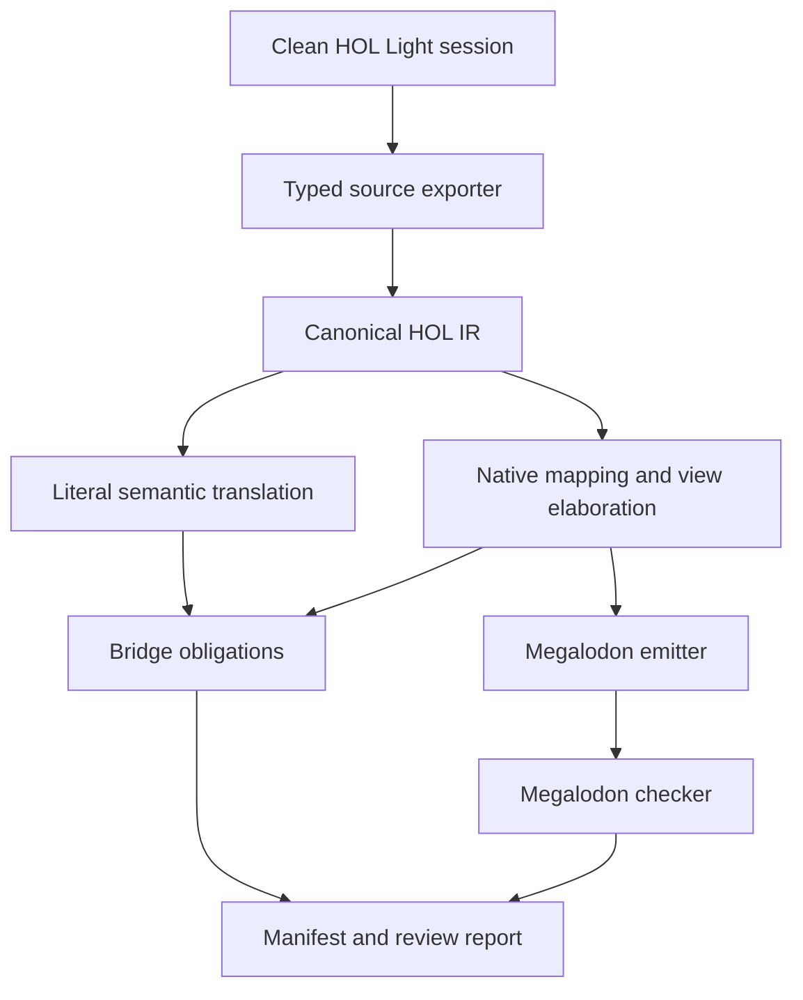

# HOL Light to Megalodon Translator

## High-level design and implementation proposal

**Status:** worker-facing design proposal

**Primary goal:** repeatedly translate the statements of a growing HOL Light corpus into a readable, native Megalodon mathematical library

**Later goal:** translate or reconstruct HOL Light proofs in checked Megalodon proof style

**Reference HOL Light revision inspected:** `433477862bb90b328a593e012e09390e99b2439b` (2026-08-17)

## 1. Executive decision

Build a two-layer translator, but publish only one layer:

1. A **private semantic layer** gives every HOL type and term a uniform, exact set-theoretic meaning. It is a GRUNGE-style correctness oracle and later a proof-transport layer. It may contain generated concepts such as source carriers, encoded application, and source symbol identifiers. It lives under an internal namespace and is not normal Megalodon API.
2. A **public native layer** states the mathematics as a Megalodon author following the Godement instructions would state it: native sets, bounded quantifiers, native numbers, meta-level functions where possible, and bounded set-functions only where functions genuinely have to be set values.

The translator must not print an `hlist`, `HOLType`, graph-function, or generic encoded-application vocabulary into the public library. It must also never silently guess a native identification. Every identification—HOL Light `num` with `omega`, HOL lists with finite sequences, HOL reals with `R`, and so on—must be an explicit, versioned mapping with a recorded correctness obligation.

During the statement-first stages, translated source theorems are emitted as `Theorem ... Admitted.`, never as new `Axiom`s. Definitions are emitted only when they are approved native definitions and typecheck. An admitted theorem is visibly unfinished and can later be replaced by a checked proof or archived only after Megalodon has checked that proof.

This is not one pass from HOL syntax to Megalodon text. It is a compiler with typed intermediate representations, a reviewed semantic mapping database, native view elaboration, deterministic emission, and aggressive validation.

## 2. Scope and non-goals

### 2.1 Statement-stage scope

The first production system must:

- load a pinned HOL Light revision and selected library profile in a clean process;
- extract typed theorem statements without parsing HOL pretty-printed text;
- retain source names, hypotheses, polymorphic instances, and provenance;
- translate logical structure deeply into Megalodon propositions;
- map reviewed mathematical types and constants to existing or newly approved native Megalodon concepts;
- generate readable `.mg` modules plus machine-readable manifests and review reports;
- incrementally regenerate only affected outputs;
- run the Megalodon checker on all generated statement modules;
- make uncertainty or missing mappings explicit rather than emitting plausible-looking mathematics.

### 2.2 Deferred scope

The first system does **not** need to:

- translate HOL tactics;
- make admitted theorems trusted;
- reproduce the layout of HOL Light proof scripts;
- automatically invent a native representation for every user-defined type;
- preserve source theorem names as the public API when a better native name exists;
- expose the uniform semantic encoding to ordinary Megalodon users.

Proof recording and proof compilation are a later workstream described in Section 15.

## 3. What “the statement is right” means

A statement is not right merely because both sides parse or look analogous. For each source theorem, the pipeline must maintain three artifacts:

1. **Source statement:** an alpha-canonical typed HOL sequent, extracted from the kernel value.
2. **Literal semantic statement:** a compositional set-theoretic interpretation of that sequent.
3. **Public native statement:** the mathematical theorem a Megalodon user should see.

The public statement has one of these statuses:

| Status | Meaning | Publication policy |
|---|---|---|
| `exact_native` | The native statement is a definitional or directly certified rendering of the literal semantics. | Publish. |
| `transport_required` | It uses an explicit isomorphism or representation change, such as HOL reals to `R` or lists to finite sequences. A bridge obligation is recorded. | Publish only after mapping review; theorem remains admitted until proof transport exists. |
| `generalization_required` | It deliberately removes a source inhabitedness premise or otherwise states a more native generalization. The extra case or strengthening obligation is recorded. | Publish only after review; preferably prove the small generalization early. |
| `pending_mapping` | Some source concept has no approved native meaning. | Do not put it in the default public module. Include it in reports or an opt-in quarantine module. |
| `raw_only` | Only the private literal statement is available. | Internal output only. |

The manifest must record a bridge plan for every `transport_required` or `generalization_required` item. Later, a theorem is fully trusted only when both the literal HOL proof and all required transport/generalization steps have checked Megalodon proofs.

This distinction is essential for such identifications as:

- HOL Light `num` ↔ Megalodon `omega`;
- HOL Light `int` ↔ Megalodon `int`;
- HOL Light `real` ↔ Megalodon `R`;
- HOL Light `A list` ↔ native finite sequences over `A`;
- HOL predicates `A -> bool` ↔ subsets of `A`;
- HOL function values `A -> B` ↔ members of `B :^: A` when they must be sets.

## 4. Target-language policy: follow the Godement rules

The emitter and mapping reviewers must enforce these rules.

### 4.1 Use meta-level functions by default

A unary mathematical operation should normally have Megalodon type `set -> set`; a binary operation should normally have `set -> set -> set`. A predicate should normally use `set -> prop` when it is used as a predicate rather than as mathematical data.

Examples:

```text
f : set -> set
op : set -> set -> set
P : set -> prop
```

Give such functions bounded closure conditions where necessary:

```text
forall x :e A, f x :e B
```

### 4.2 Reify a function only at a set-value boundary

When a function has to inhabit a function space, a list, a tuple, a set, or another HOL value, reify it with the native bounded lambda:

```text
(fun x :e A => f x) :e B :^: A
```

Apply a reified function with native `ap`/implicit application. Use the standard `lam_Pi`, `beta`, `beta0`, `Pi_ext`, `Pi_eta`, and `ap_Pi` infrastructure; do not introduce ordered-pair graph APIs into generated public code.

### 4.3 Use native sets and bounded quantifiers

Translate membership and domain restrictions to idiomatic forms such as:

```text
forall x :e A, ...
exists x :e A, ...
X c= A
```

Use `omega`, `int`, `rational`, and `R` for reviewed identifications with HOL Light number systems. Reuse target definitions instead of duplicating them.

### 4.4 Use `Admitted`, not invented axioms

Statement-only output has the form:

```text
Theorem seq_map_id : ... .
Admitted.
```

The exact terminating syntax must be verified against the selected Megalodon revision, but the semantic policy is fixed: an unproved import is an admitted theorem, not a newly asserted axiom.

## 5. The crucial function-value discipline

This is the most important elaboration rule.

It is attractive to translate every HOL function `f : A -> B` to a Megalodon variable `f : set -> set`. That is correct only while `f` is used applicatively on arguments from `A`. It is not generally correct to translate HOL function equality to Megalodon meta-function equality: two meta-functions may agree on every member of `A` and differ elsewhere, whereas they denote the same HOL function.

The translator therefore tracks a **view** of every function expression.

| View | Megalodon form | Use |
|---|---|---|
| `MetaFun(A,B)` | `f : set -> set` plus `forall x :e A, f x :e B` | Direct application and ordinary operator arguments. |
| `SetFun(A,B)` | `F :e B :^: A` | Stored, compared as a value, nested inside a datatype, or passed to a higher-order operation whose domain is a function carrier. |

Conversions are native:

```text
quote[A,B](f) = fun x :e A => f x
run(F)        = fun x:set => F x
```

The concrete output normally inlines these conversions. `quote` and `run` are names in the compiler IR, not required public Megalodon constants.

The elaboration rules are:

- HOL application `f x` stays `f x` when `f` has `MetaFun` view.
- If `F` has `SetFun` view, application is native set-function application `F x`.
- A meta-function entering data is emitted as `fun x :e A => f x`.
- A set-function used applicatively is viewed as `fun x:set => F x`.
- HOL equality at function type is emitted either as equality of reified functions or, preferably, the readable equivalent `forall x :e A, f x = g x`.
- A function nested under another HOL type constructor is always a set value. For example, `(A -> B) list` maps to finite sequences over `B :^: A`, not finite sequences over a Megalodon meta-type.

Example: for `H : (A -> B) -> C` and `f : A -> B`, make `H` a meta-function on the native carrier `B :^: A`, then translate `H f` as:

```text
H (fun x :e A => f x)
```

with closure premise:

```text
forall F :e B :^: A, H F :e C
```

This avoids both graph-style public functions and unsound dependence on a meta-function outside its HOL domain.

### 5.1 Required elaboration algorithm

Do not implement this discipline as ad hoc pretty-printer cases. Give the native elaborator an explicit judgment:

```text
elaborate(environment, source_term, expected_role)
  -> native_term * generated_conditions * bridge_steps
```

The relevant `expected_role`s are:

- `Prop`: a proposition;
- `SetValue(C)`: a set member of carrier `C`;
- `MetaFun(A,B)`: an applicative meta-function from `A` to `B`;
- `Predicate(A)`: a meta-predicate on `A`;
- `Subset(A)`: a set contained in `A`;
- `Carrier`: a set used as a type carrier.

The environment records a source variable's HOL type, its current native view, its carrier parameters, and all already generated closure/subset conditions.

Use these deterministic rules:

1. **Variables and mapped constants:** consult their typed registry role. If it differs from `expected_role`, insert only a registered view conversion.
2. **Application:** first inspect the source operator's complete type and mapping entry. Elaborate each argument in the role declared by that entry. For an unmapped source function, use its HOL domain carrier to decide between meta application and native set application.
3. **Lambda:** in `MetaFun(A,B)` role emit a meta-lambda and generate bounded result closure; in `SetValue(B :^: A)` role emit `fun x :e A => ...` directly.
4. **Equality:** at a carrier whose values are functions, compare reifications or emit bounded pointwise equality. At predicate/subset type, compare subsets extensionally. At ordinary set-valued types, use set equality.
5. **Data construction:** tuple, finite-sequence, set, and other carrier constructors request `SetValue` children. This automatically reifies nested functions and predicates.
6. **Higher-order application:** the domain carrier of an outer source function determines the inner value representation. If the input HOL type is `A -> B`, the outer function accepts a member of `B :^: A`; quote an applicative inner function at that boundary.
7. **Formula escape:** deep translation may use `prop` only while the boolean remains in formula context. If it becomes data, inject it into the approved first-class Boolean carrier.
8. **No implicit coercion:** if more than one view conversion could apply, or a required bridge is unregistered, stop with a diagnostic containing the source subterm and expected role.

Run a post-pass that checks every inserted quote has the right bounded domain and every meta-function free variable has sufficient closure premises. This check must operate on typed native IR, not emitted text.

## 6. Native carrier design

Every HOL value type still has a set-valued carrier when the type is used as data. The public carrier registry begins as follows.

| HOL Light type | Native Megalodon carrier/view | Notes |
|---|---|---|
| type variable `'a` | set parameter `A` | Add `A <> Empty` by default; remove only by certified empty-case generalization. |
| `bool` in formula position | `prop` | Translate connectives and quantifiers deeply. |
| first-class `bool` | canonical two-element set | Use only when booleans are data. |
| `'a -> 'b` as a value | `B :^: A` | Use meta-function view when applicative; reify at value boundaries. |
| `'a -> bool` as a predicate/set | `Power A`, normally a subset `X c= A` | Application becomes membership. Particularly natural for HOL Light sets. |
| `'a # 'b` | `A :*: B` | Use native tuple/set-product infrastructure. |
| `'a list` | `finseq A` | Define as finite sequences, not a generated HOL datatype wrapper. |
| `num` | `omega` | Requires reviewed operation and induction bridges. |
| `int` | `int` | Requires a source-to-target isomorphism/operation bridge. |
| `real` | `R` | Requires a substantial bridge; do not infer it from the shared name. |
| `complex` | approved native complex carrier | Reuse target library if present; otherwise define natively over `R`. |
| `real^N` / Cartesian types | appropriate native finite product/function carrier | The finite-index type and dimension conventions need explicit mappings. |

### 6.1 Lists as finite sequences

A native starting point is:

```text
Definition finseq : set -> set :=
fun A => Sigma_ n :e omega, A :^: n.

Definition seq_map : (set -> set) -> set -> set :=
fun f l => (l 0, fun i :e l 0 => f (l 1 i)).
```

The final definitions must be adapted to existing target names and proved well-typed. The corresponding public image of HOL Light `MAP_ID` should look like ordinary Megalodon mathematics:

```text
// HOL Light: lists.ml / MAP_ID
Theorem seq_map_id :
  forall A:set, forall l :e finseq A,
    seq_map (fun x:set => x) l = l.
Admitted.
```

The source’s nonempty type-variable convention does not need to remain in this particular public theorem: if `A` is empty, the only finite sequence over `A` is empty, so the statement still holds. That omission must be tagged `generalization_required` until the empty case is mechanically certified.

For a list of functions, no new meta-type is needed:

```text
finseq (B :^: A)
```

An applicative function is inserted into such a list as `fun x :e A => f x` and recovered applicatively with native set-function application.

### 6.2 Type definitions

Do not mechanically reproduce every HOL Light `new_type_definition` as an abstract target wrapper. Classify it:

- **existing native concept:** map it to the existing target carrier;
- **structural datatype:** map it to a native sum, product, finite sequence, tree, or other set construction;
- **subtype:** map it to separation `{x :e A | P x}` when that is the intended mathematics;
- **quotient:** use or build a native quotient construction and record the equivalence relation;
- **opaque or not yet understood:** keep it internal or `pending_mapping`; do not invent a public representation.

The abstraction and representation constants from HOL Light become bridge material, not automatically part of the public API.

## 7. Compiler architecture



Implement the components as separate packages with a stable serialized boundary after extraction. Recommended implementation languages:

- **HOL exporter:** OCaml, loaded inside HOL Light.
- **Translator and emitter:** typed OCaml with `dune`; it can share schema types with the exporter but must run as a standalone deterministic program.
- **Configuration:** checked YAML or JSON decoded into typed OCaml values. Never interpret mapping templates as unchecked string substitution.
- **Target validation:** invoke the selected Megalodon binary as an external checker. Do not duplicate its parser/typechecker unless a stable library interface becomes available.

Suggested repository layout:

```text
hol2mg/
  dune-project
  hol_export/
    export.ml
    export_profile.ml
    json_writer.ml
  lib/
    source_ir.ml
    semantic_ir.ml
    native_ir.ml
    canonicalize.ml
    native_elab.ml
    dependency.ml
    manifest.ml
  mappings/
    core.yaml
    sets.yaml
    data.yaml
    numbers.yaml
    analysis.yaml
    overrides/
  emit/
    megalodon_emit.ml
    names.ml
  profiles/
    core.yaml
    standard.yaml
    multivariate.yaml
    full.yaml
  tests/
    fixtures/
    golden/
    integration/
  generated/
    internal/
    public/
    manifests/
    reports/
  docs/
```

Generated files should normally be committed separately from the translator or published from CI, depending on the target library workflow. In either case, source revision and mapping revision are pinned in every generation manifest.

## 8. HOL Light extraction design

### 8.1 Never parse printed terms

Use the kernel-level constructors and destructors exposed by `fusion.ml`:

- types: `Tyvar`, `Tyapp`, `types`, `get_type_arity`;
- terms: `Var`, `Const`, `Comb`, `Abs`, `type_of` and destructors;
- theorems: `dest_thm`, `hyp`, `concl`;
- declarations: `constants`, `definitions`, `axioms`.

Pretty printing loses binding identity, instantiated constant types, and stable syntax information. It is for diagnostics only.

### 8.2 Theorem-name discovery is not a kernel feature

A HOL Light theorem value does not carry its OCaml binding name. The current repository’s `update_database/update_database_5.ml` finds top-level values whose OCaml type is `thm` by inspecting the OCaml toplevel environment and evaluating them. This is the right initial mechanism, with two caveats:

1. it uses OCaml internals and `Obj.magic`, so the version-specific update-database file must match the OCaml compiler;
2. the environment contains aliases and potentially unrelated theorem values.

Use a hybrid policy:

- for stock and automatically loaded libraries, call the matching `Lookuptheorems.all_theorems()` after the profile has loaded;
- deduplicate aliases by canonical sequent hash while preserving every source alias in metadata;
- allow profiles to give explicit `(name, thm)` registrations for user projects or ambiguous cases;
- retain `database.ml` as a stable fallback for the standard library, but do not rely on it for newly loaded formalizations;
- fail the build if an explicitly requested theorem cannot be found.

Do not pretend that a static regex over `let NAME = prove ...` is authoritative. A source indexer may provide advisory file/line provenance, but kernel values determine statements.

### 8.3 Clean build profiles

Each export profile specifies:

- exact HOL Light Git commit;
- OCaml version and startup command;
- root files to `needs`;
- optional theorem includes/excludes;
- expected source file digests;
- explicit theorem registrations if needed;
- resource limits.

Run every profile in a clean process. HOL Light’s loader tracks loaded files by basename and digest; an ambient interactive session is unsuitable for reproducible export.

Recommended initial profiles are `core`, `standard`, `multivariate`, and `full`. Additional projects get their own roots without changing the compiler.

### 8.4 Source IR

Serialize records as versioned JSON Lines initially. Each record has a `schema_version`, `kind`, stable identity, and provenance. Use de Bruijn indices for bound variables in the canonical form, while retaining original binder names for diagnostics.

Core type:

```text
hol_type :=
  | TyVar(stable_id, display_name)
  | TyApp(source_name, hol_type list)

term :=
  | Bound(index, hol_type)
  | Free(stable_id, display_name, hol_type)
  | Const(source_name, occurrence_type, inferred_type_arguments)
  | App(term, term, result_type)
  | Lam(display_name, domain_type, body, function_type)

sequent := {
  hypotheses : term list;
  conclusion : term;
}
```

For every constant occurrence, preserve its fully instantiated occurrence type. Recover explicit type arguments by matching the registered principal constant type against the occurrence type; reject non-unique or inconsistent matches.

Theorem metadata includes:

- all discovered source aliases;
- preferred source name;
- canonical sequent hash;
- source revision and export profile;
- best available source file/line;
- constants and type constructors referenced;
- whether it is an axiom, definition theorem, named theorem, or generated declaration;
- extraction warnings.

### 8.5 Definitions and provenance

At minimum, export snapshots of `types()`, `constants()`, `definitions()`, `axioms()`, and all named theorems. For better provenance, add a small translation-build patch around the HOL loader that records file entry/exit and declaration deltas. Keep this patch minimal and tested against every pinned upstream revision.

Do not make exact statement extraction depend on perfect file provenance. If loader instrumentation breaks after an upstream update, extraction should still work and mark provenance incomplete.

## 9. Intermediate representations and passes

Use three typed IRs.

### 9.1 Canonical HOL IR

Contains only source constructs and types. Passes:

1. validate types of every node;
2. alpha-canonicalize binders;
3. normalize theorem hypothesis order deterministically without changing multiplicity semantics;
4. identify deep logical structure (`forall`, `exists`, implication, conjunction, equality, choice, conditionals);
5. compute stable hashes and dependency sets.

### 9.2 Literal semantic IR

Implements the uniform set-theoretic translation:

- each HOL type is a nonempty set carrier;
- arrow types are native function sets;
- applications use set application;
- lambdas use bounded set lambdas;
- formulas are translated deeply to `prop` whenever possible;
- first-class booleans use a fixed set encoding only when required.

This layer should be boring, compositional, and exact. Optimize for auditability, not beauty. It provides a fallback and later proof target, but is never the normal imported library.

### 9.3 Native Megalodon IR

This IR distinguishes:

- `SetTerm` and `PropTerm`;
- arbitrary Megalodon meta-types needed by meta-functions;
- bounded quantifiers;
- `MetaFun` and `SetFun` views;
- target carrier expressions;
- native definitions, theorem declarations, imports, comments, and proof placeholders;
- generated side conditions and bridge obligations.

Passes:

1. resolve type-carrier mappings;
2. resolve overloaded source constants by full type scheme, not just name;
3. translate formula structure;
4. infer use contexts and function/predicate views;
5. insert reification or dereification at boundaries;
6. synthesize closure, subset, and inhabitedness premises;
7. simplify through approved native rewrite rules;
8. rename to public target names;
9. build bridge/generalization obligations;
10. pretty-print only after the typed IR validates.

## 10. Mapping registry

The mapping registry is the semantic heart of the project and should receive code-review discipline comparable to source code.

A type mapping entry includes:

```yaml
source_type: "list('a)"
target_carrier: "finseq(${A})"
kind: "native_isomorphism"
target_module: "data/finseq.mg"
bridge: "hol_list_finseq_iso"
nonempty_rule: "finseq_nonempty"
status: "reviewed"
```

A constant mapping entry includes at least:

```yaml
source_name: "MAP"
source_scheme: "('a -> 'b) -> 'a list -> 'b list"
target_name: "seq_map"
arguments:
  - role: "meta_function"
    domain: "A"
    codomain: "B"
  - role: "set_value"
    carrier: "finseq(A)"
result:
  role: "set_value"
  carrier: "finseq(B)"
side_conditions:
  - "forall x :e A, f x :e B"
bridge: "hol_MAP_seq_map"
status: "reviewed"
```

Required fields are:

- source name and complete polymorphic type scheme;
- target symbol or typed AST template;
- argument and result roles (`set_value`, `meta_function`, `predicate`, `proposition`, `carrier`);
- carrier parameters and generated side conditions;
- representation class (`definitionally_exact`, `native_isomorphism`, `generalization`, `opaque`);
- bridge theorem or named proof obligation;
- target module/import;
- review status, reviewer, and mapping version;
- source and target revision bounds if APIs change.

Unknown or ambiguous entries are errors in strict public mode. A separate audit mode may generate internal literal statements for them.

### 10.1 Predicates and sets

HOL Light represents sets as predicates. Prefer actual target subsets:

- a variable `s : A -> bool` in set role becomes `S:set` plus `S c= A`;
- `s x` becomes `x :e S`;
- predicate abstraction becomes separation;
- predicate equality becomes set equality;
- a list of predicates becomes `finseq (Power A)`.

Keep a meta-predicate `P:set->prop` only when the source object is being used logically and does not need to become mathematical data. View conversion between a predicate and a subset must be explicit in the IR.

### 10.2 Inhabitedness

Every HOL type is nonempty. A public set parameter is not automatically nonempty. Therefore:

- initially emit `A <> Empty` for each genuinely abstract source type variable;
- omit it when another structure premise implies nonemptiness;
- remove it only through a certified empty-carrier rule or a proved generalization;
- never drop it as a pretty-printing heuristic.

The empty-case prover can be a small later pass. It should reduce bounded quantifiers and native carriers on `A = Empty` and generate a Megalodon proof obligation. Until discharged, classify the public theorem as `generalization_required`.

## 11. Output organization and naming

Separate authored target infrastructure from generated material:

```text
mglib/
  native/                 # reviewed, reusable Megalodon definitions and bridges
    finseq.mg
    hol_transport.mg
  hol_light/
    statements/
      core.mg
      lists.mg
      sets.mg
      arithmetic.mg
      analysis_*.mg
    proofs/                # added later
    quarantine/            # optional pending mappings; not normally imported
  _generated_internal/
    literal_*.mg           # not public API
  manifests/
    <profile>-<revision>.json
  reports/
    coverage.md
    statement_review.html
```

Public names should follow existing Megalodon mathematical naming conventions and avoid collisions. Keep HOL Light names as searchable aliases in comments and the manifest. For example:

```text
// Source: hol-light/lists.ml, theorem MAP_ID
// Source hash: sha256:...
// Mapping status: transport_required (list <-> finseq)
Theorem seq_map_id : ...
```

If two HOL names have the same canonical sequent, emit one target theorem and record all aliases. If a native target theorem with the same normalized statement already exists, record reuse rather than duplicating it. Any name collision with a different statement is a hard error.

## 12. Incremental and repeatable operation

The normal command should be conceptually:

```text
hol2mg update --profile standard --hol-light-rev <commit> --check
```

The build is content-addressed at these boundaries:

- source file digest and HOL Light revision;
- canonical source theorem hash;
- mapping registry version/hash;
- native IR hash;
- emitter version;
- target foundation/Megalodon revision.

Regeneration rules:

- if only a source theorem proof changes but its kernel statement hash does not, statement output does not change;
- if a theorem statement changes, regenerate it and all target items whose translation depends on it;
- if a mapping changes, regenerate every item using that mapping;
- if formatting alone changes, keep semantic hashes and produce an isolated formatting diff;
- never rewrite an unchanged shard;
- remove an output only when the manifest proves its source disappeared and the change report names it explicitly.

Every run produces a summary:

- HOL revision and profile;
- loaded source file digests;
- theorem counts: discovered, unique, public, internal-only, skipped;
- mapping coverage by source module and concept;
- new, changed, removed, and renamed statements;
- bridge/generalization obligations;
- checker result;
- warnings that block publication.

Use stable sorting independent of OCaml hash-table order or toplevel enumeration order.

## 13. Validation and quality gates

### 13.1 Extraction gates

- Recompute every node’s HOL type and compare it with the serialized type.
- Verify all bound indices, free variables, and source type variables.
- Reconstruct an in-memory HOL term from the source IR and compare it by alpha-equivalence with the original.
- Compare `hyp`/`concl` and reconstructed `dest_thm` components.
- Reject constants whose instantiated type arguments cannot be recovered consistently.
- Report aliases and hash collisions.

### 13.2 Translation gates

- Typed native IR must check before printing.
- Every source free variable and hypothesis must have a documented image.
- Every inserted side condition must name its source type/use reason.
- Every removed source condition must produce a generalization obligation.
- Every native identification must point to a reviewed mapping entry.
- Function equality, predicate equality, and higher-order function arguments receive dedicated checks for view errors.
- Public output has a forbidden-artifact lint: no `HOLType`, `hlist`, generic raw application, graph-function constructor, or unapproved internal namespace.
- Public output has no newly generated `Axiom` declaration.

### 13.3 Megalodon gates

- Every generated module parses and typechecks with the pinned Megalodon build.
- A run succeeds only when the checker emits its explicit success indication, currently `Everything looks good.`
- Run the warnings recommended by the Godement workflow, including leading-space and reproven-theorem warnings where applicable.
- Definitions are checked in full; admitted theorem bodies remain clearly marked.
- Before replacing `Admitted` with `Qed`, run a complete check, not only an incremental line-range check.

### 13.4 Golden and adversarial fixtures

The minimum fixture suite covers:

1. propositional connectives and quantifiers;
2. polymorphic equality;
3. ordinary functions and extensional function equality;
4. higher-order functions receiving functions;
5. lists, nested lists, lists of functions, and `MAP`;
6. predicates as subsets and lists of predicates;
7. products and nested products;
8. `num`, induction, arithmetic, and conditionals;
9. source type definitions and subtypes;
10. choice/`ARB`, where nonemptiness matters;
11. empty-carrier generalization successes and failures;
12. integers, reals, vectors, and dimension-indexed types;
13. theorem assumptions, aliases, and duplicate statements;
14. deliberately unmapped concepts, which must fail strict mode cleanly.

Property-based generation of small well-typed HOL terms is valuable for the raw semantic translator and view insertion. Golden tests remain necessary for public readability.

### 13.5 Human statement review

Generate a side-by-side review page with:

- source HOL syntax;
- canonical source IR;
- public Megalodon statement;
- type and constant mappings used;
- inserted and removed premises;
- function/predicate view conversions;
- bridge status and links;
- source and target names.

Review is semantic, not cosmetic. A reviewer can approve, reject, or add an override. An override is versioned mapping data, not a handwritten edit to generated `.mg` output.

## 14. Statement-stage implementation plan

The following milestones are ordered so that each yields a testable artifact. Effort ranges are indicative for one worker familiar with OCaml and theorem provers; corpus-specific mapping work is inherently open-ended.

### Milestone 0 — Reproducible harness and contracts (about 1 week)

Deliver:

- repository skeleton and `dune` build;
- pinned HOL Light and Megalodon revisions;
- `core` and `standard` load profiles;
- source/native schema documents;
- generation manifest format;
- a one-command clean integration test.

Acceptance:

- two clean runs at the same revisions produce byte-identical manifests;
- upstream/source revisions are visible in output;
- a failed source load or target check fails the command.

### Milestone 1 — Exact typed source exporter (2–3 weeks)

Deliver:

- OCaml exporter over kernel destructors;
- version-aware top-level theorem discovery using the matching update-database implementation;
- alias deduplication by canonical sequent hash;
- snapshots of types, constants, definitions, and axioms;
- JSONL source IR and round-trip tests;
- explicit-registration escape hatch.

Acceptance:

- all named theorems in the chosen standard profile export;
- reconstructed terms are alpha-equivalent to originals;
- exporter does not parse pretty-printed syntax;
- duplicate theorem values preserve aliases without duplicate semantic records.

### Milestone 2 — Literal semantic translator (2–3 weeks)

Deliver:

- uniform carrier/function-set translation;
- deep logical translation;
- internal Megalodon emitter;
- raw coverage and invariant report;
- fixtures for polymorphism, lambdas, equality, and first-class booleans.

Acceptance:

- every supported HOL IR node translates compositionally;
- all internal output typechecks with admits;
- no unsupported source construct is silently dropped;
- literal statement hashes are stable.

### Milestone 3 — Native core and function-view elaborator (3–5 weeks)

Deliver:

- typed native IR;
- mapping registry decoder and validator;
- `MetaFun`/`SetFun` and predicate/subset view inference;
- explicit boundary conversions;
- inhabitedness premise synthesis;
- core mappings for logic, equality, choice, functions, products, and basic sets;
- public emitter and forbidden-artifact lint.

Acceptance:

- all higher-order adversarial fixtures translate correctly;
- function equality is never accidentally meta-equality outside its domain;
- public output uses Godement-style functions and bounded lambdas;
- unknown mappings fail strict mode.

### Milestone 4 — Native data library: finite sequences and naturals (4–6 weeks)

Deliver:

- reviewed `finseq`, constructors, destructors, recursion/induction interface, and `seq_map`;
- source list-to-finite-sequence mappings;
- mappings for `num` to `omega` and common operations;
- statement translations for `lists.ml` and initial arithmetic files;
- bridge obligation catalogue.

Acceptance:

- all selected list statements, including lists of functions and predicates, typecheck publicly;
- no public HOL datatype wrapper appears;
- `MAP_ID` and representative recursion/induction theorems pass human review;
- mappings state exactly which transport theorems remain admitted.

### Milestone 5 — Sets, algebra, integers, reals, and finite vectors (ongoing; first useful slice 6–10 weeks)

Work concept-by-concept, not file-by-file string replacement:

1. HOL Light sets/predicates and set operators;
2. algebraic structures and operations already native in Megalodon;
3. integers and rationals;
4. real numbers and ordered-field/analysis primitives;
5. complex numbers;
6. Cartesian finite types and vectors;
7. calculus, measure, and larger analysis concepts.

Each concept slice delivers reviewed type/constant mappings, bridge obligations, golden statements, and a coverage delta. Prefer reusing the pre-Godement target library. Do not duplicate existing definitions merely to make translation easier.

Acceptance for a slice:

- 100% of included public statements typecheck;
- all non-native items are explicit in the coverage report;
- target-name collision and duplication checks pass;
- a mathematical reviewer signs off representative statements and every nontrivial representation choice.

### Milestone 6 — Production incremental updater and CI (3–4 weeks, partly parallel with Milestone 5)

Deliver:

- content-addressed cache;
- module dependency graph and deterministic sharding;
- source-update diff report;
- review dashboard;
- CI jobs for extraction, translation, lint, and Megalodon checking;
- safe handling of removed/renamed theorems;
- performance and memory telemetry.

Acceptance:

- a HOL Light update that changes proofs but not statements causes no public statement diff;
- a mapping change regenerates exactly its dependents;
- unchanged generated files retain byte identity;
- a normal update produces an actionable report, not a monolithic diff.

### Milestone 7 — Coverage expansion

Add HOL Light profiles and mapping slices continuously. Use these priorities:

1. concepts already present in native Megalodon;
2. broadly reused foundation modules;
3. mathematically important theorem families;
4. high-dependency blockers in the coverage report;
5. specialized one-off source encodings last.

Never lower the strict-mode bar to claim a higher translation percentage.

## 15. Later proof-export project

Proof export should begin only after representative public statements and mappings have stabilized. Otherwise proof work will repeatedly target moving representations.

### 15.1 Source proof acquisition

HOL Light’s `Proofrecording` build supports proof objects. Its documentation recommends `HOLPROOFOBJECTS=EXTENDED`, which records selected derived rules as well as kernel rules and produces smaller proof objects than `BASIC`. It supplies `save_thm`, named `nprove`, and `export_saved_proofs`.

Create a separate proof-recording profile; do not burden normal statement updates with proof objects. First test it on a small stable corpus. Measure build time, memory, proof DAG size, and coverage before committing to full-library runs.

### 15.2 Proof IR

Import proofs into a content-addressed DAG with maximal sharing. Nodes initially cover the HOL kernel rules:

- `REFL`, `TRANS`, `MK_COMB`, `ABS`, `BETA`;
- `ASSUME`, `EQ_MP`, `DEDUCT_ANTISYM_RULE`;
- `INST_TYPE`, `INST`;
- definitions, type definitions, and source axioms.

Then support the extended recorded rules one by one. Each proof node records its exact input and output sequents; the importer checks these independently of names.

### 15.3 Two-part proof compilation

Because public statements are native rather than literal, most proofs have two stages:

1. **HOL proof translation:** compile the recorded HOL proof into a Megalodon proof of the private literal theorem.
2. **Native transport:** use proved bridges, isomorphisms, view laws, and empty-carrier generalizations to derive the public theorem.

This division is deliberate. Trying to compile every HOL proof directly into a changing native representation will entangle proof reconstruction with all mapping decisions.

The first transport library should prove generic facts for:

- bounded lambda/application and extensionality;
- predicate/subset conversion;
- products and finite sequences;
- datatype recursion/induction transports;
- inhabitedness and empty-carrier generalization;
- equality and logical relations under isomorphisms.

### 15.4 Megalodon proof style

Generated proof modules should use normal Megalodon theorem blocks and checked proof steps ending in `Qed`. Local direct proof terms are appropriate for primitive logical/kernel steps. Larger mathematical obligations may use structured `let`, `assume`, `claim`, `apply`, `rewrite`, and `exact` steps. ATP-backed `aby` calls may later shorten reconstructible subgoals, but they are an optimization, not the initial trust story.

Only after a complete Megalodon check may a theorem be converted to the project’s archived-proof form. Never emit `ProofArchived` merely because HOL Light proved the source theorem.

### 15.5 Proof milestones

1. Translate kernel proofs of a tiny logical corpus.
2. Add definitions and type instantiation.
3. Prove and use generic literal-to-native bridges for functions, predicates, products, and finite sequences.
4. Translate a self-contained list/arithmetic module end-to-end.
5. Add extended proof-object rules and DAG sharing.
6. Scale by dependency closure, not raw theorem count.
7. Add ATP/hammer reconstruction only after deterministic proof compilation is reliable.

The proof project is likely larger than the statement compiler because it combines proof-object coverage, representation transport, proof-term size control, and target proof engineering.

## 16. Operational policies for the worker

### 16.1 Never hand-edit generated statements

Fix the exporter, typed mapping, native rewrite, or override registry. Regenerate and review. Hand edits create an unrepeatable fork from the source corpus.

### 16.2 Preserve useful output

Generated deletions and large line-count decreases require an explicit report. A failed update must leave the last successful generation intact. Write into a staging directory, check completely, then atomically promote the manifest/output set.

### 16.3 Prefer explicit failure

These are build errors in strict mode:

- ambiguous source constant instance;
- missing carrier mapping;
- unreviewed native identification;
- unresolved target name collision;
- target checker does not report success;
- generated public axiom;
- function view cannot be elaborated without an unrecorded extensionality assumption;
- a theorem loses a hypothesis or gains an undocumented premise.

### 16.4 Track upstream changes

On each HOL Light update:

1. fetch and pin the requested commit;
2. run clean extraction;
3. compare source statement hashes;
4. regenerate affected native statements;
5. inspect mapping breakages and declaration changes;
6. run complete target checks;
7. publish the update report with the new manifest.

If the OCaml environment enumeration breaks, add support for the new compiler version rather than weakening extraction.

## 17. Definition of done for statement translator v1

The first production release is done when:

- source extraction is typed, round-tripped, deterministic, and revision-pinned;
- the chosen initial HOL Light profiles update with one command;
- the public target has no generic HOL type/list/application artifacts;
- public functions follow the Godement meta-function/bounded-reification discipline;
- representative higher-order, predicate, list-of-function, and empty-carrier cases are correct;
- every public identification is reviewed and has a bridge status;
- every generated theorem is either checked or visibly `Admitted`; none is invented as an axiom;
- every generated module passes the pinned Megalodon checker;
- unknown concepts are quarantined with useful diagnostics;
- repeated runs are byte-deterministic and incremental diffs are small;
- a reviewer can trace every target statement back to its exact HOL sequent and mappings.

A release may have incomplete coverage. It may not have silent semantic uncertainty.

## 18. Immediate first tasks

The worker should start in this order:

1. Create the repository skeleton, lockfiles, revision manifest, and `core` profile.
2. Implement `hol_type` and `term` export plus alpha-canonical round-trip tests.
3. Export ten deliberately difficult named theorems: polymorphic equality, function equality, higher-order composition, a predicate/set theorem, `MAP_ID`, a list-of-functions theorem, a choice theorem, natural induction, a real theorem, and a finite-vector theorem.
4. Implement theorem enumeration, alias deduplication, and explicit registrations.
5. Implement literal semantic translation for those fixtures.
6. Implement the typed mapping registry and native view elaborator.
7. Build and prove enough native `finseq` infrastructure to make list statements natural.
8. Generate the first side-by-side statement review report.
9. Run Megalodon on every generated module and enforce the no-axiom/no-artifact lints.
10. Only then broaden file coverage.

This fixture-first order forces the architecture to confront polymorphism, higher-order values, predicates, native data, nonemptiness, and existing mathematical carriers before it can accidentally harden around easy first-order examples.

## 19. Source basis

This design is based on:

- Brown et al., **GRUNGE: A Grand Unified ATP Challenge**, especially Section 5.1 on the semantic set-theoretic translation of HOL types and terms: <https://arxiv.org/abs/1903.02539>
- Brown et al., **Hammering Higher Order Set Theory**, for Megalodon’s higher-order Tarski–Grothendieck setting and proof/hammer context: <https://arxiv.org/abs/2509.08264>
- the Godement project instructions, especially the rules preferring `set -> set` functions, bounded lambdas only when functions must be sets, native `Pi`/`setexp`, bounded quantifiers, and admitted theorems rather than new axioms: <http://173.249.37.175/~mptp/god1/tst7/CLAUDE.md>
- HOL Light kernel interface: <https://github.com/jrh13/hol-light/blob/433477862bb90b328a593e012e09390e99b2439b/fusion.ml>
- HOL Light theorem database updater: <https://github.com/jrh13/hol-light/blob/433477862bb90b328a593e012e09390e99b2439b/update_database/update_database_5.ml>
- HOL Light proof recording: <https://github.com/jrh13/hol-light/blob/433477862bb90b328a593e012e09390e99b2439b/Proofrecording/README>
- HOL Light list theory, including `MAP` and `MAP_ID`: <https://github.com/jrh13/hol-light/blob/433477862bb90b328a593e012e09390e99b2439b/lists.ml>
- Megalodon `100thms_12.mg`, including native `Sigma`, bounded lambda/application, `Pi`, `setexp`, and representative proof scripts: <https://raw.githubusercontent.com/mgwiki/mgw_test/refs/heads/main/mglib/100thms_12.mg>

The older topology formalization is intentionally not a design basis for this proposal.

## 20. Implementation status and decision log (maintained by the worker)

This section records how the implementation in this repository (`/project/hol2mg`) instantiates
the design above and where it deliberately deviates.  Interim reports live in `docs/reports/`.

### 20.1 Ordering

The native statement layer (Milestones 0, 1, 3, 4) was built first; the literal semantic layer
(Milestone 2) is deferred until native statements are stable, because the user's stated priority
is correct, repeatable native statements.  `lib/literal.ml` is a stub.

### 20.2 Toolchain facts (pinned in `profiles/lock.json`)

- HOL Light `4334778`, OCaml 4.14.1, camlp5 8.02.01, no zarith: `bignum_num.ml` is used and the
  `ocaml-hol` toplevel plus `hol.sh` are built by hand (the Makefile insists on zarith for 4.14).
  `hol.ml` does **not** load `update_database.ml`; the exporter loads it explicitly.
- Megalodon `e0fba57`, built from `repos/Megalodon` with `makeopt`.  A full check of God1.mg
  takes ~60 s; generated modules are checked in 3–4 s against a signature file produced by
  `megalodon -s` (`mglib/God1.mgs`) and an index regenerated with `-indout` (the index shipped in
  the god1 repository is stale and rejects newer definitions).
- Megalodon syntax facts verified by experiment: `->` is a right-associative infix at level 800;
  binders, `fun`, `if` extend as far right as possible; `forall x y :e A,` and `forall s c= A,`
  are accepted; `Theorem N : S.` followed by `Admitted.` is the admitted-import form; notations
  declared inside a `Section` do not survive `End` but are not reliably restored either, so the
  final notation table is determined empirically (`tools/probe_notations.py`).

### 20.3 Registry and elaboration

- Registry: JSON, templates in Megalodon syntax (`mappings/core.json`).  Roles
  `set | prop | subset | metafun[/k] | metapred[/k]`; the arity of a meta slot defaults to the
  scheme's arity and can be pinned (`metafun/1` for `K -> A -> bool` used as a set-valued family).
- Views by usage analysis (design §5.1 rule 2 realised as: meta unless a data occurrence exists).
- Built-ins: connectives, `=` (iff / pointwise / set), `!`, `?`, `?!` (desugared), `@`
  (`choose_in`), `COND`, `NUMERAL`, `GSPEC`/`SETSPEC` comprehensions, `INSERT … EMPTY`
  enumerations, HOL beta-redexes (approved rewrite, noted).
- Inhabitedness: premise emitted per type variable, dropped only when `lib/emptycase.ml`
  syntactically proves the `A := Empty` instance; recorded as bridge `empty_case:A`.
- Reuse: theorems whose proposition Megalodon reports as already known are emitted as comments
  (`native_reuse`).

### 20.4 Native infrastructure

`mglib/native/prelude.mg` (hand-written, checked, theorems currently `Admitted`): `choose_in`,
`minus_nat`, `nat_pred`, `div_nat`, `mod_nat`, `even_nat`, `odd_nat`, `div_int`, `rem_int`,
`neutral_of`, `iterate_op`, `finsum`, `finprod`.  Reused from God1 instead of redefining:
`finite`, `infinite`, `equip` (`HAS_SIZE`), `finite_cardinality` (`CARD`), `inj`, `bij`,
`sup`, `inf`, `is_lub`, `is_glb`, `sqrt_SNo_nonneg`, `divides_int`, `divides_nat`, `factorial`.

### 20.5 Status (2026-08-28, report 3)

core 2684/2984, standard 4289/4590, mv_vectors (Multivariate/vectors.ml) 4783/5084 public; all
remaining pending theorems concern quarantined internals.  All shards check; golden tests pass.

### 20.6 Automatic definitions (extends §6.2 and §10)

Unmapped constants and types are translated from their kernel definitions when no hand mapping
exists: `new_definition` right-hand sides (arity = leading lambdas, carriers as leading set
parameters, roles by type), `new_specification` constants as `choose_in carrier (fun c => spec c)`,
and `new_type_definition` types as separations `{x :e [[tau]] | P x}` with identity `abs`/`rep`.
They are generated in dependency order into `_definitions.mg`, marked `auto`, never override a
hand mapping, and are listed with their failures in the manifest and report.  Recursive
definitions made by `define` are still quarantined (their kernel form uses recursion machinery).

### 20.7 Open items

1. Megalodon-checked empty-case proofs to certify `generalization_required` statements.
2. Proofs of the native prelude theorems (`prelude.mg`, `finseq.mg`, `order.mg`).
3. Literal semantic layer (§9.2) before the proof-export project.
4. Side-by-side HTML review page (§13.5).
5. Hand overrides for auto definitions where readability matters (`vector_norm`, `distance`).
